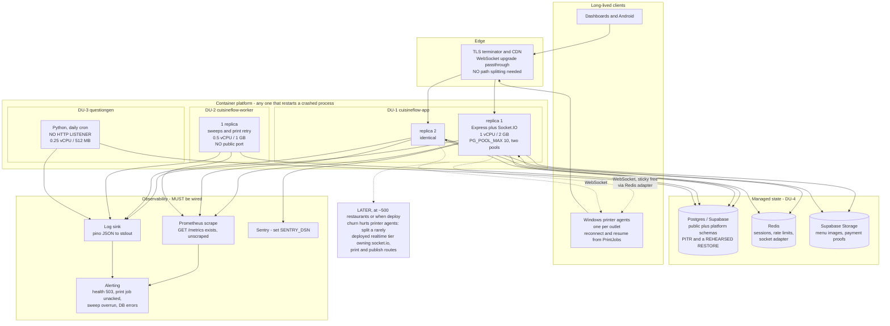

# ARCHITECTURE REDESIGN — CuisineFlow / Restaurant Dash

**Status:** PROPOSAL FOR REVIEW. Nothing in this document has been implemented.
**Date assembled:** 2026-08-15, against the working tree.
**Scope:** backend (`Restaurant_Backend`), with references to `Restaurant_Dashboard_UI` and `restaurant_owner_app` where they constrain the backend.

**How to read this document.** Every section is marked **CURRENT** (what the code does today) or **PROPOSED** (what this document argues for). Where a proposal was rejected or deferred during review, the rejection is recorded with its reasoning rather than quietly dropped — see §5.10, §8.5 and §17.5. Claims carry `path:line` evidence. Anything that could not be established without querying a database or reading a secret is marked **UNVERIFIED** and is never presented as fact.

**Method.** Source was read directly. **No database was queried. No `.env` was read. No source, schema, migration or config file was modified.** The schema was reconstructed from `migrations/000`–`026` plus the runtime `create table if not exists` / `add column if not exists` blocks in `database_supabase.ts` and `Python_servers/db.py`.

Paths are relative to `C:/Users/mechi/Downloads/Restaurant Dash/Restaurant_Backend/` unless stated otherwise.

---

## Table of contents

1. [Executive summary](#1-executive-summary)
2. [Current architecture analysis](#2-current-architecture-analysis--current)
3. [Current database analysis](#3-current-database-analysis--current)
4. [Current problems register](#4-current-problems-register--current)
5. [Proposed domain model](#5-proposed-domain-model--proposed)
6. [Proposed ER diagram](#6-proposed-er-diagram--proposed)
7. [Proposed table and entity grouping](#7-proposed-table-and-entity-grouping--proposed)
8. [Proposed service boundaries](#8-proposed-service-boundaries--proposed)
9. [Database ownership strategy](#9-database-ownership-strategy--proposed)
10. [Proposed service architecture diagram](#10-proposed-service-architecture-diagram--proposed)
11. [Proposed deployment architecture](#11-proposed-deployment-architecture--proposed)
12. [Production optimization recommendations](#12-production-optimization-recommendations--proposed)
13. [Indexing recommendations](#13-indexing-recommendations--proposed)
14. [Transaction and consistency strategy](#14-transaction-and-consistency-strategy--proposed)
15. [Caching and event strategy](#15-caching-and-event-strategy--proposed)
16. [Migration strategy](#16-migration-strategy--proposed-conceptual-phases-only)
17. [Risks and trade-offs](#17-risks-and-trade-offs)
18. [Final recommended architecture](#18-final-recommended-architecture--proposed)
19. [BEFORE vs AFTER](#19-before-vs-after)
20. [Closing](#20-closing)

---

# 1. Executive summary

## 1.1 The verdict

**One PostgreSQL database. One primary deployable. Do not distribute this system.**

This is not a concession to team size. It is what the evidence in this codebase says.

1. **The settle path is one Postgres transaction spanning nine tables.** `ApproveBillPaymentByAdmin` (`database_supabase.ts:16067-16222`) writes `Bills` twice, `Orders`, `LoyaltyLedger`, `Bookings`, `Tables` twice, `Table_assignments`, and reads `Restaurant`, `Outlets`, `Login`, `Employees` throughout. There is **not one compensating action anywhere in the codebase**. Splitting Billing from Orders from Floor converts an atomic settle into a saga nobody has written, over money already taken from a guest, on a system that prints statutory GST invoices.
2. **Two of the three real structural invariants are Postgres index guarantees, and indexes do not span databases.** `bills_one_open_per_table` (`migrations/000_base_schema.sql:481`) is the only defence against a duplicate open bill. `loyalty_earn_bill_uniq` (`database_supabase.ts:15589`) is the only thing making the settle-time loyalty hook idempotent.
3. **The largest consumer owns nothing.** `GetAdvancedAnalytics` (`database_supabase.ts:19234`) reads 18 tables in 31 queries. Analytics is already a read model over the whole schema; distributing the writers relocates the join into application code and buys nothing.

The one place a second deployable is genuinely justified **already exists and already works**: `platform/db.ts:15` builds a separate pool as a separate role over a separate schema with a separate session store, joined to the tenant plane by exactly one versioned `SECURITY DEFINER` function (`migrations/011_billing_grace.sql:15-25`). It is the template, and the template's lesson is that a second service is viable only when it owns disjoint tables. Nothing else in this system does.

The corollary is uncomfortable. **The other service that exists today is not a boundary, it is a hole.** `Python_servers/main.py` exposes 14 endpoints with no authentication, takes the tenant id as a URL path segment, never calls `set_config('app.res_id', ...)`, writes tables Node also writes, and holds its own DDL rights. The correct architectural move on the tenant plane is to reduce the service count from two to one.

## 1.2 What actually needs doing

The highest-value work in this document is not architecture. It is an operational floor that does not exist, and none of it requires agreeing on an architecture first.

| # | Action | Effort | Why it is first |
|---|---|---|---|
| 0 | **Commit the untracked work.** `routes/`, `deploy/`, `lambda.ts`, `report_schedules.ts`, `report_render.ts`, `migrations/026_scheduled_reports.sql`, `scripts/route_manifest*`, `jest-tests/report_*` are all untracked (re-verified this session via `git status --porcelain`), while `index.ts` is modified and imports 37 files from `routes/`. | ~1 hour | One `git clean -fd` deletes the entire 277-route refactor and the whole deployment plan. There is no second copy. |
| 1 | **Stop CI writing to a production-candidate database.** `.github/workflows/backend-ci.yml:16-18` points `DATABASE_URL` at the `SUPABASE_DIRECT_URL` repo secret and runs write-capable API tests on every push to `main`. | ~1 hour | `ci.yml` already does this correctly against an ephemeral `postgres:16`. |
| 2 | **Backups plus one rehearsed restore.** No `pg_dump`, no restore tooling, no PITR confirmed anywhere in any repo. | days | It is the only thing making every later phase reversible, and the restored copy *is* the staging environment this project lacks. |
| 3 | **Provision Redis.** `REDIS_URL` is unset, so `auth/store.ts:110-144` returns a `MemoryStore` backing both sessions and rate limits. | hours | Every restart logs out every user in every tenant. It also blocks horizontal scaling and the Socket.IO adapter, both of which are already coded. |
| 4 | **Make printing durable.** `emitOutlet` opens `if (!io) {return;}` (`realtime.ts:128`) and the route returns `{success:true}` regardless (`routes/bills.ts:608`). The Windows desktop app *is* the printer. | ~1 week | A waiter gets a green tick and no receipt, silently, with no log line and no metric. |
| 5 | **Delete the Python valet endpoints.** Node already implements every one of them in `routes/valet.ts`. | ~1 week | Removes an unauthenticated write path into the tenant database and the second DDL authority. |
| 6 | **Fix the live data-correctness bugs** listed in §4: `consumeInventory` writing no stock ledger row, `AddOrder`'s lost-update race, `ReleaseTable`'s four autocommits, the `sharp` top-level import, and the authorization gaps. | ~2 weeks | Each is a demonstrated defect, not a hypothesis. |

Only after that does schema work start, and it starts with four surgical, independently shippable changes (§16, Phase 6): `Bills.grand_total`, a `kind` discriminator on tax lines, a real `Menu.price` column, and — as its own project — `Orders.food` becoming `OrderLines`.

## 1.3 What was proposed and rejected

Rejected outright: **reordering the primary key on every core table** (unbounded migration risk, no measured benefit, migration `008` already delivers the index prefix ordering); **splitting `Employees`** into identity and HR records (31 readers, six FK-referencing tables, zero correctness gain); **menu modifier catalogue tables**; **`GiftCards`**; **a new table-ownership CI guard** (the existing static-analysis tool, `scripts/route_manifest.ts`, is wired into nothing); and **`deleted_at`** as a soft-delete column (the codebase already uses `is_deleted`, 37 sites, and introducing a second flag contradicts the proposal's own no-renames principle).

Deferred: `Orders.food` → `OrderLines` (right direction, own project, behind the restore drill), `TableSessions` as aggregate root, a domain-event outbox, tax-rate history, splitting `database_supabase.ts`, the `app_runtime` cutover, and money `CHECK` constraints (ship as monitoring queries first). Reasoning is preserved in §5.10, §8.5 and §17.5.

## 1.4 One blocking finding that must be read before any `Tables` work

**Guest QR codes are HMAC-signed over `(res_id, table_name)` with no `outlet_id`, and they are printed on physical stickers.**

```ts
// qr_signing.ts:33-37 (re-read verbatim this session)
export function signTable(resId: string, tableName: string): string {
  return createHmac("sha256", SECRET)
    .update(`${resId}:${normalize(tableName)}`)
    .digest("base64url")
    .slice(0, 16);
}
```

`encodeTableToken` (`qr_signing.ts:56-59`) bundles the base64 table **name** with that signature, and `routes/guest.ts:25` resolves every guest request through `decodeTableToken`, which returns a name. Three consequences, detailed in §4.3:

- a QR from Outlet A verifies at Outlet B whenever both have a table with the same name;
- renaming a table silently invalidates its printed sticker, today;
- any redesign that makes table names unique **per outlet** rather than per restaurant blesses the collision instead of closing it.

No `Tables` redesign should be approved until this is resolved.

---

# 2. Current architecture analysis — CURRENT

## 2.1 Process topology

One Node/Express/TypeScript process (ESM) serving HTTP and Socket.IO on the same server (`realtime.ts:18-31`, `index.ts:471`), plus one Python FastAPI process, both connected to the same Supabase Postgres.

| Component | Path | Size / shape |
|---|---|---|
| HTTP entrypoint | `index.ts` | 680 lines (re-verified). Was 10,484 before the untracked refactor. |
| Route layer | `routes/` (37 files) | ~277 tenant registrations, **untracked in git** |
| Platform routes | `platform/routes.ts` | 19 registrations, registered into the same Express app (`index.ts:266`) |
| Data-access layer | `database_supabase.ts` | **25,207 lines** (re-verified). No ORM, no query builder, hand-written SQL over `pg`. |
| Pure money math | `billing_math.ts` | Zero imports. The best-factored file in the backend. |
| Realtime | `realtime.ts` | Socket.IO, Redis adapter when configured |
| Control plane | `platform/` | Separate pool, separate role, separate sessions |
| Second service | `Python_servers/main.py` (291 lines) + `db.py` (1,031) | 14 endpoints, **no authentication** |
| Printer prototype | `C_Sharp_temp_printer_server/` | A .NET MAUI project present in the backend repo. Its role relative to the Flutter printer agent is **UNVERIFIED**. |

## 2.2 The request lifecycle and how tenancy is bound

Four hops, all in-process:

| Hop | Where | Result |
|---|---|---|
| Token → identity | `index.ts:104-122` → `auth/sessions.ts:66-92` | `res_id`, `outlet_id` from the **server-side session record**, never from a client header |
| Outlet resolution | `index.ts:129-165` | `effectiveOutlet`, with membership validated for cross-outlet overrides (`:144-161`) |
| Connection bind | `index.ts:190-202` → `database_supabase.ts:1502-1547` | one pooled `PoolClient`, four GUCs, AsyncLocalStorage |
| Query | `database_supabase.ts:1241-1249` | runner selected from ALS |

The whole isolation invariant is one line:

```ts
// database_supabase.ts:1246
const runner = client ?? tenantStorage.getStore()?.client ?? (isipv4Fallback ? ipv4pool : pool);
```

If AsyncLocalStorage context is lost — a detached promise, a `setTimeout`, an unawaited emit — the query silently runs on the raw pool with **no `app.res_id` set at all**. Under today's superuser connection that returns every tenant's rows. §4.4 documents a live instance of exactly this.

**Two context mechanisms exist and they give the same data-layer function different transactional semantics:**

| | Staff / authenticated routes | Guest `/qr/*`, webhooks, sweeps |
|---|---|---|
| Entry | `requireAuth` → `openTenantConnection` (`index.ts:190`) | handler calls `withTenant(...)` explicitly |
| GUCs | `set_config(..., false)` — session-level (`database_supabase.ts:1514-1521`) | `set_config(..., true)` — transaction-local (`:1475-1482`) |
| `txnDepth` | **0** (`:1524`) | **1** (`:1483`) |
| Effect | **autocommit** — each `runQuery` is its own transaction | the **whole handler callback is one transaction** |

So `AddOrder` called from `POST /qr/:slug/order` is fully transactional; the same `AddOrder` called from `POST /orders` is not — its `Orders` insert, `Tables` update, `Bills` re-sync and inventory deduction are four independent commits.

`withTransaction` (`:1393-1451`) opens a real `BEGIN` at depth 0 and a `SAVEPOINT` at depth ≥1. Only 56 of ~311 exported data-layer functions are transactional at all.

## 2.3 Multi-tenancy: designed correctly, currently inert

Three layers exist; only the weakest is live.

- **Policies exist and are correct.** `migrations/003_enable_rls.sql:25-46`, re-swept by `007:15-36` and `008:18-39`, all `ENABLE` + `FORCE ROW LEVEL SECURITY`, predicate `res_id::text = current_setting('app.res_id', true)` on both `USING` and `WITH CHECK`.
- **The app sets the GUC per request.** `database_supabase.ts:1514-1520`.
- **The runtime bypasses all of it.** It connects as a superuser role (`rolbypassrls`), so `FORCE RLS` does not apply. `verifyTenantRlsAtBoot` (`:1337-1361`) detects this itself, logs a warning, and serves traffic unless `ENFORCE_RLS_AT_BOOT=true`.

Isolation therefore rests entirely on hand-written `where res_id = $1` across 25,207 lines. Least-privilege roles `app_runtime`/`platform_runtime` exist (`migrations/002`) and are unused; `002:22` still ships `PASSWORD 'CHANGE_ME_STRONG_PASSWORD'`.

**Three exemptions from RLS, and one correction to a widely repeated claim.** The auto-discovery loop selects tables that have a `res_id` column (`003:31-35`) and excludes `'Actions'` and `'Outlets'` by name. `"Restaurant"` has **no `res_id` column at all** (its PK is `id`, `000:313-331`), so the loop never touches it; its only policy is the explicit fail-open one at `003:50-61`. `"Outlets"` gets the same treatment at `:63-74`. Both read:

```sql
USING      ( res_id::text = current_setting('app.res_id', true) OR coalesce(current_setting('app.res_id', true), '') = '' )
WITH CHECK ( res_id::text = current_setting('app.res_id', true) OR coalesce(current_setting('app.res_id', true), '') = '' )
```

The read exemption is justified — `getRestaurantIdFromUsername` (`:1741-1750`) resolves the guest slug before any tenant context exists. **The write exemption is not**, and it sits on the two tables holding the invoice counter, the tax configuration, and three plaintext credentials. See §4.7.

`app.outlet_id` and `app.role` are set but **no policy reads them**. Outlet isolation is 100% application-level.

**"All outlets" read mode** is a sentinel (`"all"`/`"__all__"`, `routes/_shared.ts:357-360`), honoured only for admin/manager (`index.ts:125,133`), with a hard 400 on any non-GET while active (`index.ts:184-187`). It is consumed by interpolating a server-computed boolean literal into SQL at 31 call sites (`database_supabase.ts:206-208`) — safe as written, but it is string interpolation into SQL and deserves a comment at every site.

**A multi-outlet leak in the guest surface:** all 23 guest routes bind `withTenant({res_id, outlet_id: ""})`, and an empty outlet makes `resolveRestaurantContext` (`:1549-1564`, `:1639`) fall back to the restaurant's oldest outlet. A multi-outlet tenant's QR guests always land on branch #1. The only route that threads `?outlet=` is waitlist join (`routes/guest.ts:572`).

## 2.4 Authorization

- `Actions` — global, no `res_id`, RLS-exempt (`000:19-25`), written at boot by `ensureFeaturePermissionActions`.
- `Roles` — per-tenant, PK `(id, res_id)`, no outlet dimension, permissions as a JSON array of UUIDs (`000:332-340`).
- `CORE_ROLES` — a hardcoded TypeScript map of 7 role names to UUID arrays (`database_supabase.ts:45-77`), `admin: ["*"]`. Compiled into the binary, not data.
- Resolution happens **once, at login** (`:24940-24961`) and is cached in the session. Per-request checks are pure in-memory (`routes/_shared.ts:67-76`) with zero DB hits.
- Identity is **per outlet**. The same person working two branches is two `Employees` rows and two `Login` rows (`routes/auth.ts:104-107`). This is deliberate and is the hardest constraint on any identity refactor.

`validate` (`routes/_shared.ts:61-63`) is `(req,res,next) => next()` and authorizes nothing. It appears as the middleware-slot guard on **45 registrations** (re-counted this session). Most of those enforce in the handler body instead. §4.9 gives the audited picture and records a disagreement between reviewers about the exact number.

**Cache invalidation** covers role edits, role deletion, assignment changes, user deletion, password reset, tenant suspension and subscription status changes (`routes/roles.ts:79,125,165,213`; `routes/users.ts:116,161`; `platform/routes.ts:213,397,546,763`). It does **not** cover a plan change that alters `features`/`limits` — `platform/routes.ts:546` revokes only on non-active *status*, so an upgraded tenant keeps stale feature flags for up to the 12h session TTL, and the `FEATURE_BY_PREFIX` gate (`index.ts:327-347`) reads them straight from the session.

## 2.5 Realtime, and why it is load-bearing

Socket.IO on the same HTTP server. Two rooms, both derived from the verified session token, never from a client-supplied restaurant id (`realtime.ts:64-92`): `restaurant:<res_id>` (auto-joined) and `restaurant:<res_id>:outlet:<outlet_id>` (joined on explicit `joinOutlet`, `:98-105`). An unauthenticated socket connects but joins nothing (`:79-84`) — the right control, done well.

26 emit sites, 25 distinct events. **Exactly one is load-bearing:** `bill:print`, emitted from `routes/bills.ts:496` (`/publish/bill`), `:561` (one per kitchen station for KOT) and `:606` (`/print/bill`), consumed only by the Flutter Windows app (`restaurant_owner_app/lib/services/printer_service.dart:113`). Every other event is a cosmetic refresh nudge; `table:sections_updated` has no consumer at all.

There is **no realtime push for the kitchen display**. `routes/kds.ts` is one polling route (`GET /kds/expo` → `GetExpoView:10665`); `order:updated` only nudges the poll early.

`emitOutlet` opens `if (!io) {return;}` (`realtime.ts:128`) and swallows errors (`:132-134`). With `REDIS_URL` unset the Socket.IO adapter is absent (`:58-62`), so a print emitted on replica A never reaches an agent on replica B. Socket.IO CORS accepts every origin unconditionally (`:20-27`), unlike the HTTP allowlist (`index.ts:214-233`) — a policy inconsistency rather than an exploitable hole, since auth is a handshake bearer token, not a cookie.

## 2.6 Scheduled work

| Job | Interval | Location | Cross-instance safety |
|---|---|---|---|
| Exception checks + booking reminders | 30 min | `index.ts:595` | **none** — a per-process `exceptionSweepRunning` flag plus 24h dedupe |
| Scheduled reports | 5 min default | `index.ts:624` | `(schedule_id, occurrence_key)` unique index + attempts CAS. Ships dark behind `REPORT_SCHEDULER` |
| Platform billing cycle | 24 h | `platform/routes.ts:238` | `pg_try_advisory_lock` (`platform/db.ts:47-62`) |
| Feedback question regeneration | 02:00 | `Python_servers/main.py:64-65` | APScheduler, no lock |

The exception sweep is a **serial `for` loop over every tenant** (`index.ts:569-594`) running inside the process serving POS traffic. The code's own comment (`:563-567`) admits there was no leader-lock pattern when it was written. The report sweep, written later, has the best concurrency design in the codebase and is the pattern to copy.

## 2.7 Operations

**There is no production hosting.** Searching all three repos to depth 3 for `Procfile`, `railway.*`, `fly.toml`, `render.yaml`, `vercel.json`, `netlify.toml`, `app.yaml`, `*.tf`, `ecosystem.config*` returns zero hits. `Dockerfile.node`, `Dockerfile.python` and `docker-compose.yml` **are tracked**; the AWS SAM stack in `deploy/` and `lambda.ts` are **untracked and never deployed** (`deploy/samconfig.toml:78-80` still carries AWS's `111122223333` placeholder account). The app runs from a laptop through a dev tunnel.

**There is no CD.** Three workflows, all test-only. The two backend workflows use contradictory database strategies and both trigger on push to `main`.

**There is no staging and no backups.** The only mention of restore in any repo is aspirational (`deploy/README.md:937`, pointing at a paid Supabase PITR tier whose availability is **UNVERIFIED**).

**There is no alerting.** `observability.ts` is a complete, competent pino + Sentry + prom-client implementation (`:12-29`, `:33-49`, `:62-82`) wired to nothing. `/metrics` (`routes/misc.ts:69`) is a well-built endpoint no one scrapes, and it is **open to the world when `METRICS_TOKEN` is unset** (`:88-92`). `/health` is real and returns 503 when the DB is down (`:46-66`).

**Nothing restarts the process.** `uncaughtException` → `logger.fatal` → `process.exit(1)` with the comment "let the platform restart" (`index.ts:670-674`), and there is no platform. Detection of an outage today means a restaurant phoning.

## 2.8 Realistic workload

The team's own statement of who the customer is, from `migrations/009_subscription_tiers.sql:9-19`: starter ₹0 / 5 employees / 1 outlet; growth ₹1,499 / 25 / 1; enterprise ₹3,999 / unlimited. Enforced in exactly two places, both fail-open (`routes/users.ts:32-43`, `routes/outlets.ts:44-53`).

Rate limits on public routes (`routes/_shared.ts:521`) are the clearest committed sizing signal: 120/min aggregator, 30/min guest order, 15/min login, 15/min guest pay, 20/min feedback, 12/min waitlist join.

Query shape: **205 hardcoded `limit 1`** in the data layer against a thin tail of wider scans (`limit 5000` at `:8583`, `limit 2000` at `:12968`). `PG_POOL_MAX` defaults to 10 with **two pools per process** (`database_supabase.ts:119-135`). Body limit 15 MB JSON (`index.ts:253-262`), sized for base64 images.

**Inference, labelled as such:** this is a small-concurrency, high-burst-around-mealtimes OLTP workload. Peak matters; sustained throughput does not. Nothing in it argues for distribution.

---

# 3. Current database analysis — CURRENT

## 3.1 Shape

**52 tables plus one runner bookkeeping table.** 47 in `public`, 5 in `platform`. 40 have a migration; **12 exist only as lazy runtime DDL**. 24 tables have a `create table if not exists` site in `database_supabase.ts`, 12 of which duplicate a migration. `migrations/000_base_schema.sql` is self-described as introspected from the live database (`000:2`), so it is the authority on what production actually has.

`database_supabase.ts` contains **24 `create table if not exists` and 94 `add column if not exists`** sites.

### The 12 tables created by no migration

`TableSessions` (`:2439`), `StockMovements` (`:7165`), `Campaigns` (`:7701`), `PayrollProfiles` (`:7808`), `PayrollPayments` (`:7823`), `DiscountRequests` (`:11647`), `SettlementBatches` (`:13999`), `Coupons` (`:15183`), `CouponRedemptions` (`:15203`), `LoyaltyLedger` (`:15571`), `AggregatorOrders` (`:16337`), `OutboundMessages` (`:21136`).

**Every one has zero foreign keys** — not by choice, but because the lazy path cannot safely add a constraint that may already exist under a different name. A schema that cannot be reproduced from migrations cannot be restored from a backup, diffed, or reviewed.

## 3.2 Primary keys

14 tables are composite, 33 public tables are a bare single column.

The canonical composite is `(id, res_id, outlet_id)` on 10 tables: `Bills` `000:80`, `Bookings` `:93`, `Customers` `:126`, `Employees` `:140`, `Feedback_entries` `:173`, `Menu` `:207`, `Menue_main_cat` `:217`, `Orders` `:254`, `Tables` `:365`, `Valet_vehicle_state` `:387`. Four more are composite but differently shaped: `Inventory (barcode,res_id,outlet_id)`, `Login (res_id,outlet_id,emp_username)`, `Menue_sub_cat (id,res_id,outlet_id,main_cat_id)`, `Roles (id,res_id)`.

**The cost is the column order, not the inconsistency.** Every tenant query filters `where res_id = $1 and outlet_id = $2`. A btree leading with `id` — never in the predicate — cannot serve that scan. That is why `Bookings`, `Customers`, `Menu`, `Menue_main_cat`, `Menue_sub_cat`, `Feedback_entries`, `Roles`, `Valet_vehicle_state` and `Parking_Bays` have **zero usable indexes** despite looking covered, and why migration `008` had to bolt `(res_id, outlet_id, ...)` indexes onto 10 hot tables.

Secondary cost: composite PKs force composite child FKs — `EmployeeLeaves` needs a 3-column FK (`024:34-43`), `Menu` a 4-column one (`000:459`). `Menue_sub_cat`'s 4-column PK is not a key at all; `id` alone is unique, and `main_cat_id` is in it only so `Menu` can hang a 4-column FK off it.

**This is a real defect with a bad fix.** See §5.10 — reordering existing PKs is rejected.

## 3.3 The JSON blobs that should be relational

| Column | Holds | Cost, in code |
|---|---|---|
| `Menu.description text` (`000:197-208`) | `{price, image_url, available, modifiers, recipe, station, allergens, blurb, price_updated_at, price_baseline}` via `encodeMenuDescription:946-974` | **The menu has no price column.** Price cannot be indexed, constrained, summed or joined. `parseMenuDescription:980-1001` returns `price: 0` on a parse failure, so **a malformed blob prices a dish at zero**. The whole blob is rewritten to change one field, which is exactly the bulk-save shape that wiped 56 items' images and recipes; `restoreMenuDescriptionFields:6190-6207` and the read-merge in `PATCH /menu/:id/price` (`:8306-8317`) exist only to defend it. `recipe[]` is a dish↔ingredient M:N with a soft FK to `Inventory.barcode`. |
| `Orders.food json NOT NULL` (`000:249`) | line items, `total`, `subtotal`, taxes, `customer_phone`, `taken_by_employee_id`, `delivery_address`, `items_split`, course-hold flags | **There is no `OrderItems` table.** `:9787` states it: orders carry no total column. `:9790-9791` regex-guards a numeric cast so a malformed blob cannot abort the Overview. Revenue is recomputed by parsing JSON on every read (`sumOrderTotalsForTable:11279`). No per-dish sales query can be written in SQL. |
| `Bookings.slot text NOT NULL` (`000:92`) | start, duration, status, deposit payment record, reminder flag, `combined_table_ids[]` | `decodeSlot:1188-1233` has a bare-`catch` that treats an unparseable blob as `new Date(slot)` with status "Confirmed" — **a corrupted reservation silently becomes a confirmed one.** Booking start time is inside a text blob, so **no index can serve the availability query at all.** `bookingTableIds:1160-1168` warns that checks "MUST go through this or a clubbed table could be double-booked". |
| `Bills.tax_breakdown json` (`000:62`) | `[{name, percentage, amount}]` | GST is a statutory return. You cannot `sum(cgst)` over a period in SQL; `GetGstReport:13672` re-parses per row in JS. There is **no tax ledger** — the return is only as correct as whatever each settle path snapshotted. |
| `Outlets.default_tax json` (`000:266`) | `{"SGST":2.5,"CGST":2.5,"Service Charge":1}` | No rate history. Service charge and government tax are indistinguishable, which is the bug at `:13301-13309`: a tenant's own income can be booked as tax owed. |
| `Employees.emp_roles json` (`000:136`) | `{primary, all[]}` where entries are **either** a core role name **or** a `Roles.id` UUID (`parseEmployeeRoles:817-838`) | `DeleteRole:23434-23450` deletes restaurant-wide but sweeps employees at one outlet only, leaving dangling role UUIDs everywhere else. It fails closed (unknown UUID contributes no actions), so it is a correctness and UX bug, not escalation. |
| `Roles.actions_performable json` (`000:338`) | array of `Actions.id` | Role↔Action M:N with no FK; a deleted action leaves dangling grants. |
| `Inventory.description text` (`000:182`) | `{category, unit}` (`:846-865`) | `:9800` says it: "`unit` is not a column either". Two tables use a column named `description` for two incompatible JSON schemas. |
| `PurchaseOrders.items jsonb` (`000:302`) | line items with `inventory_id`, `vendor_id` | Unenforced soft FKs (`:7660-7667`). |
| `Bills.payment_splits jsonb` (`:15120`) | split tender | `GetReconciliation:14049-14056` matches settlement batches to bills by **free-text method string**. |

**Correctly JSON, and should stay:** `Restaurant.payment_config` / `feedback_config` / `brand_config` (read whole, written whole, never queried by inner field); `platform.plans.features` / `.limits` (an opaque flag bag handed to the app); `Notifications.meta`; `AggregatorOrders.raw` (a third-party payload).

## 3.4 Foreign keys

FKs exist only for the `000` base tables plus `Table_sections` (`023`) and `EmployeeLeaves` (`024`). Unenforced relationships the application clearly implies include: `Attendance.emp_id`, `Table_assignments.table_id`/`.employee_id`, `Waitlist.table_id`/`.placed_order_id`, `PurchaseOrders.vendor_id`, `StockMovements.inventory_id`/`.vendor_id`, `DiscountRequests.bill_id`, `CouponRedemptions.coupon_id`, `LoyaltyLedger.bill_id`, `AggregatorOrders.order_id`, `PayrollProfiles.emp_id`, `PayrollPayments.emp_id`, `PushSubscriptions.waitlist_id`, `Valet_vehicle_meta.booking_id`, and `PayrollPayments` ↔ the `Expenses` row it creates (**no link at all**, `:7971`).

**Cascades that destroy records that should survive:**

| Constraint | Effect |
|---|---|
| `Valet_vehicle_state.bay_id → Parking_Bays ON DELETE CASCADE` (`000:475`) | Deleting a parking bay destroys the record that cars were parked in it — and `Python_servers/db.py:958` deletes bays with no authentication. The column is also `uuid default gen_random_uuid() not null` (`000:386`) — **a FK column whose default is a random UUID that can never satisfy the FK.** |
| `platform.invoices.res_id` and `platform.subscriptions.res_id → Restaurant ON DELETE CASCADE` (`006:11`, `004:37`) | Deleting a tenant destroys **the SaaS's own paid invoice history**. |
| `Audit_logs.res_id → Restaurant ON DELETE CASCADE` (`000:433`) | Deleting a tenant erases their entire audit trail — while `Audit_logs.outlet_id` has no `ON DELETE` at all, so deleting one *branch* is blocked. Deleting the whole restaurant is easier than deleting a branch of it. |
| `Bookings.cust_id → Customers ON DELETE CASCADE` (`000:440`) | Deleting a guest erases their reservation history. |
| `EmployeeLeaves ... ON DELETE CASCADE` (`024:43`) | Deleting an employee destroys their approved-leave record — while the same migration's own comment (`024:53-56`) says the decision trail must survive the *approver's* deletion. Migration `015` dropped the `Audit_logs` employee FK for exactly this reason; `024` reintroduced the pattern nine migrations later. |

`ReportDeliveries.schedule_id ON DELETE NO ACTION` (`026:109-123`) is the one place this is reasoned through properly, with a comment explaining why `NO ACTION` beats `RESTRICT`. **That is the standard the rest of the schema should meet.**

## 3.5 Money typing and constraints

Every tenant money column is bare `numeric` with no precision or scale — `grep -rnE 'numeric\([0-9]' migrations/` returns nothing. `Bills.total_amt` `000:61`, `discount_value` `:73`, `refund_amount` `:76`, `Expenses.amount` `:151`, `Inventory."Quantity"` `:183`, `PurchaseOrders.total_cost` `:303`, `Outlets.service_charge` `:326`, all six `CashSessions` money columns `:105-110`.

Meanwhile the **platform** schema bills in integer cents (`004:27`, `006:13`). The SaaS bills itself in minor units and bills restaurants in unconstrained numerics.

**Across all 26 migrations there are exactly 15 CHECK constraints**, all on `EmployeeLeaves` (`024:45,51,64`) and `ReportSchedules`/`ReportDeliveries` (`026:52-95,139`) — the two newest and least business-critical tables. `000` has zero.

**On the "JS floats" concern — the arithmetic itself is fine.** `billing_math.ts` applies `round2` at every intermediate step (`:36,37,38,64,74,76,78,79,81`) and `activeOrderSubtotal` rounds the accumulated sum (`:11276`). IEEE doubles carry 15–17 significant digits; a restaurant bill needs 8. **The defect is that every money invariant lives only in TypeScript** while the data has at least three writers: Node, the Python service, and any `psql` session — and the runtime connects as superuser, so nothing constrains manual repair either. The existence of `scripts/repair_historical_bills.ts` tells you hand-repair happens.

**What *is* protected, and deserves credit:** every *concurrency* invariant was enforced in the database. `bills_one_open_per_table` (`000:481`), `loyalty_earn_bill_uniq` (`:15589`), `invoices_razorpay_payment_uniq` (`010:13`), `aggregator_orders_uniq` (`:16348`), `coupons_res_outlet_code_uniq` handling the nullable outlet correctly with `coalesce` (`:15217`). The pattern is exact: concurrency invariants in the DB, value invariants in JS.

**The single highest-value missing constraint** is on `Bills.bill_no`, the GST invoice number. It appears in the migrations exactly once, as a column declaration (`000:71`). No unique constraint, no index. Looking a bill up by invoice number is a sequential scan, nothing detects a gap, and nothing prevents a duplicate.

## 3.6 One physical thing stored several ways

1. **"A party is at this table right now"** is stored four ways: `Tables.is_occupied` + `num_covers`, the open `Bills` row, the open `TableSessions` row, and `assertTableSessionOpen:11399` deriving it from `Orders` status codes.
2. **Bill line items do not exist.** A bill's lines are recomputed from `Orders.food` on every read. "Order" and "bill line item" are the same entity under two names.
3. **The guest is four identities**: `Customers` (has an id), `Orders.food.customer_phone`, `LoyaltyLedger.customer_phone`, `CouponRedemptions.customer_phone`. Loyalty and coupons key on a **phone string**, not `Customers.id`.
4. **Suspension exists twice**: `Restaurant.account_status` (`platform/routes.ts:389`) and `platform.subscriptions.status` (`:205`). Neither writes the other; `platform.restaurant_status()` OR-s them at read time (`011:16-18`).
5. **"Table" means two things**: a physical floor object, and a disposable order container (`provisionVirtualTable:16278` mints `is_virtual` rows for takeaway/delivery/aggregators, soft-deleted on settle at `:16298`).
6. **Valet vehicle state** is written by two runtimes (Node `:5286-5474`, Python `db.py:427-687`) and split across two tables, one of which has two identical indexes (`000:495-496`).

## 3.7 Tables carrying more than one domain

- **`Restaurant`** — the migration declares 18 columns (`000:313-332`); `ensureBrandingColumns` adds **33 more at runtime** (`:20990-21076`). 51 columns spanning at least thirteen domains, including three plaintext secrets (`razorpay_key_secret` at `000:325`; `msg_key_secret` and `msg_webhook_secret` added at runtime, `:21052-21054`) on a table that RLS makes **fail-open**.
- **`Outlets`** — outlet identity + `default_tax` + `bill_seq`, a monotonic counter mutated on every bill creation.
- **`Tables`** — furniture + live occupancy + covers + OTP + `linked_order_id` + `is_virtual` order container + `is_deleted`.
- **`Bills`** — invoice + payment record + four-stage approval workflow + refund record (four nullable columns, so a bill can be refunded exactly once, ever) + discount/coupon + tax snapshot.
- **`Coupons`** — two products in one table: `kind='promo'` (a discount rule) and `kind='gift'` (a prepaid instrument with a `balance`, which is money).

## 3.8 Genuinely independent

`feedback_questions` (lowercase, no `res_id`, no RLS, written only by the 02:00 Python job — **the one genuinely separable table in the system**), `PasswordResetRequests`, `OutboundMessages`, `Campaigns`, `ReportSchedules`/`ReportDeliveries`, `platform.admins`/`platform.audit`.

## 3.9 The `platform` schema is the better-modelled half

`platform.admins` `004:13`, `plans` `004:23`, `subscriptions` `004:35`, `audit` `004:47`, `invoices` `006:9`. Integer cents, real unique partial indexes for replay protection, no RLS (isolation by grant, `004:69-79`), separate pool as `platform_runtime`, separate sessions, exempt from the tenant auth gate (`index.ts:304`), joined to the tenant plane by exactly two `SECURITY DEFINER` functions whose consumers **fail open** (`database_supabase.ts:24820-24846`) — so the tenant plane runs correctly with the control plane absent. That is a separable context *demonstrated*, not asserted.

---

# 4. Current problems register — CURRENT

Severity is ranked by three questions in order: **what is irreversible if lost**, **what is causing damage right now**, and **what blocks the rest**.

## CRITICAL

### 4.1 The entire refactored route layer is untracked in git

`git status --porcelain` (re-verified this session): `index.ts` and `database_supabase.ts` are **modified**; `routes/`, `deploy/`, `lambda.ts`, `report_schedules.ts`, `report_render.ts`, `migrations/026_scheduled_reports.sql`, `scripts/route_manifest.ts`, `scripts/route_manifest.baseline.txt` and three `jest-tests/report_*` files are **untracked**. `index.ts:14-50` imports 37 modules from `routes/`.

A `git clean -fd`, a fresh clone, or a disk failure deletes ~277 route handlers and leaves a modified `index.ts` importing 37 files that no longer exist. The last committed state is the 10,484-line `index.ts` the refactor replaced. There are no backups and no staging, so there is no second copy anywhere.

**Fix:** commit, today, before anything else on this list.

### 4.2 CI runs write-capable tests, and seeds a demo tenant with a published password, against a production-candidate database

`.github/workflows/backend-ci.yml:16-18` sets `SUPABASE_DIRECT_URL`, `DATABASE_URL` and `DIRECT_URL` all to the `secrets.SUPABASE_DIRECT_URL` repo secret, writes them to `.env` (`:44-49`), runs `docker compose up -d --build` (`:56`), then runs `test:feedback_api` and `test:valet_api` (`:68-72`) — which create valet records, add bays and delete a bay (`test/valet_api_test.ts:50,116,183,204`).

`docker-compose.yml` sets no `NODE_ENV` for the node service, so `index.ts:487` evaluates `process.env.NODE_ENV !== "production"` as true and `bootstrap()` seeds "CSR Organics" with `employeeId: "admin", password: "admin123"` (`index.ts:490-509`). The 24 lazy `create table` and 94 `add column` blocks also execute against that database.

**Whether `SUPABASE_DIRECT_URL` points at the database serving real restaurants is UNVERIFIED** — the secret cannot be read. That uncertainty is itself the finding: nobody can tell from the repository, and the consequence if it is the live database is severe. `ci.yml` already does this correctly against an ephemeral `postgres:16` service.

**Fix:** point `backend-ci.yml` at the ephemeral service; set `NODE_ENV=production` in compose so the demo seed must be opted into; then determine whether the CSR Organics tenant exists in the live database and rotate.

### 4.3 BLOCKING — guest QR signatures omit `outlet_id`, and the tokens are physical objects

```ts
// qr_signing.ts:33-37
createHmac("sha256", SECRET).update(`${resId}:${normalize(tableName)}`)
```

`encodeTableToken` (`:56-59`) bundles the base64 table name with that signature; `routes/guest.ts:25` resolves every guest request through `decodeTableToken(resId, token)`, which returns a **name**; generation is at `database_supabase.ts:3559-3560` and `:17400`.

The signing construction is otherwise good — `timingSafeEqual`, fail-closed, no plain table name in the URL, a loud warning when the secret is unset (`qr_signing.ts:25`). The defect is the missing dimension:

1. **Cross-outlet forgery.** The signature contains no `outlet_id`. Nothing today prevents two outlets of one restaurant both having a table named "Table 5"; a QR printed for Outlet A verifies at Outlet B. **UNVERIFIED** whether any live tenant currently has colliding names across outlets — but the construction permits it.
2. **A proposed per-outlet name uniqueness key would normalize the collision** rather than close it. Any `Tables` redesign must therefore bind the signature to the outlet.
3. **Renaming a table silently invalidates its printed sticker today**, and any scheme that frees a deleted table's name lets an old sticker resolve to a different physical table — orders landing on the wrong bill.

**Fix:** include `outlet_id` in the signed payload with a versioned token prefix so existing stickers keep verifying during a transition; treat `table_name` as an external, published identifier in every future design.

### 4.4 A detached background task reuses the HTTP request's connection after that connection has been rolled back and returned to the pool

`routes/_shared.ts:757-775` `queueBookingConfirm` is a `void`-detached `withTenant(...)` whose own comment claims it "Opens its OWN tenant context so it can safely outlive the request that queued it." That is false, because `withTenant` short-circuits on re-entry:

```ts
// database_supabase.ts:1460-1462
if (tenantStorage.getStore()) {
  return work();          // reuses the CALLER's client; the ctx argument is discarded
}
```

`routes/bookings.ts:186-194` calls it from the authenticated `POST /add-booking` handler and returns at `:196`. `release` then runs `ROLLBACK`, blanks all four GUCs, and returns the client to the pool (`database_supabase.ts:1525-1545`), registered on both `finish` and `close` (`index.ts:197-201`).

Outcomes: the detached `RecordOutboundMessage` insert can land inside another tenant's open transaction; two async chains can interleave queries on one connection; or `ROLLBACK` discards writes the detached task believed it made. The `.catch` only logs (`routes/_shared.ts:774`), so nothing surfaces.

After the RLS cutover this gets *quieter*, not safer: a post-`release` write is contextless, which every table except `Restaurant` and `Outlets` refuses — see §4.7.

**Fix:** make `withTenant` throw on a mismatched context rather than silently discarding it; add an explicit `withOwnTenant()` for detached work; and preferably write the outbound message row inside the request transaction and let the existing 30-minute sweep deliver it (`routes/_shared.ts:783`).

### 4.5 DDL runs inside money transactions

```ts
// database_supabase.ts:18269-18276 (verbatim, re-read this session)
let outletColumnsEnsured = false;
async function ensureOutletColumns(client?: PoolClient): Promise<void> {
  if (outletColumnsEnsured && !client) {return;}      // guard never fires when a client is passed
  await runQuery(`alter table "Outlets" add column if not exists is_active boolean not null default true`, [], client);
  await runQuery(`alter table "Outlets" add column if not exists bill_seq integer not null default 0`, [], client);
  if (!client) {outletColumnsEnsured = true;}          // memo never set when a client is passed
}
```

`nextBillNo` calls it unconditionally (`:18282-18283`). Verified call sites of `nextBillNo`: `:11584`, `:11934` (`MergeTableBills`), `:15005` (`AddBill`, **no client**), `:15529` (`ApplyCouponToBill`), `:15888` (`ConfirmBillPaymentByWaiter`), `:16040` (`SubmitCustomerPayment`), `:16629` (online payment finalisation). Five of the seven pass a transaction's client.

Postgres takes `ACCESS EXCLUSIVE` on the relation for `ALTER TABLE` **before** evaluating `IF NOT EXISTS`, and holds it until the enclosing transaction commits. `"Outlets"` is read by `resolveRestaurantContext` (`:1576-1596`, `:1620-1645`) on effectively every data-layer call, **for every tenant** — it is not partitioned by `res_id`. One restaurant confirming one bill therefore stalls every other request in the deployment.

The same class of problem sits on the approval path: `ApproveBillPaymentByAdmin`'s **first statement** is `ensureBillWorkflowColumns(client)` (`:16073` → `:15039-15042`), 17 `ALTER TABLE` statements on the hot `Bills` table.

**Correction to a claim repeated in earlier drafts:** `nextBillNo` is **not** called inside `ApproveBillPaymentByAdmin`. The function's own comment (`:18278-18281`) states the `update ... returning` is atomic on its own "with or without a surrounding transaction". Any argument for co-locating `Outlets` with `Bills` must rest on the settle path reading `Outlets.default_tax` (`:16137-16141`), not on `bill_seq`.

**A second, separate defect found in the same place:** `AddBill:15005` calls `nextBillNo(context)` with **no client, outside any transaction**. If the subsequent insert fails, the invoice number is burnt and the GST series gets a gap.

**Fix:** delete `ensureOutletColumns` and add `is_active` / `bill_seq` in a real migration. Adopt the rule that no DDL runs in a transaction that touches money. Pass the client through `AddBill`.

### 4.6 RLS is inert, and `runQuery` has no floor

Covered in §2.3. Two aggravating details: `isipv4Fallback` is a **module-level mutable global** written inside `openTenantConnection` (`:1508,1511`) and `withTenant` (`:1467,1470`) and read by every contextless `runQuery` — raced across all concurrent requests. And `ipv4pool` is constructed with `connectionString: undefined` when `SUPABASE_IPV4_URL` is unset (`:99`, `:130-136`), which makes `pg` fall back to libpq defaults, i.e. **localhost** — so on a machine with a local Postgres, the fallback can connect to an entirely different database and then route every contextless query there globally.

**Fix:** make `runQuery` throw when there is no explicit client and no ALS store. Refuse to construct `ipv4pool` when its variable is unset. Move `isipv4Fallback` into the ALS store.

### 4.7 The fail-open RLS exemption applies to `WITH CHECK`, not just `USING`

`003:50-61` and `:63-74`, quoted in §2.3. The read exemption is justified by the pre-session slug lookup. The **write** exemption is not, and it sits on the tables holding `bill_seq` (the GST invoice counter), `default_tax`, and three plaintext credentials. Combined with §4.4 and §4.6, this is the one place where a lost-context write is *permitted by policy* rather than refused — and it survives the `app_runtime` cutover untouched.

`Outlets` being fail-open also means that with a cleared GUC, the full tenant and branch list is readable.

**Fix (four lines):** keep the disjunction in `USING`, make `WITH CHECK` strict. Better: move the slug lookup into a `SECURITY DEFINER` function returning just the id, and drop the exemption from `USING` too.

### 4.8 A second service writes the database with no authentication

`Python_servers/main.py` — 14 endpoints, tenant as a URL path segment:

```python
@app.post("/create_valet_record/{number_plate}/{restaurant_id}")   # :163
@app.get("/get_all_valet_records/{restaurant_id}")                 # :175
@app.post("/delete_bay/{restaurant_id}")                           # :213
```

Verified absences across `main.py` and `db.py`: **zero** occurrences of `Depends`, `api_key`, `authorization`, `bearer`; **zero** occurrences of `set_config` or `app.res_id`; no CORS middleware. It binds `0.0.0.0` (`main.py:285`, `Dockerfile.python:51`) and `docker-compose.yml:9-10` publishes `8000:8000`. It runs its own DDL: `feedback_questions` (`db.py:100`) and `"Valet_vehicle_meta"` (`db.py:127`, duplicating `database_supabase.ts:4902`).

`res_id` values are not secret — they appear in guest QR URLs and in the feedback form's `X-Restaurant-Id` header. Anyone who can reach port 8000 can read or write any tenant's valet data.

It is also the hard blocker on the RLS cutover: under `NOBYPASSRLS` every Python query returns zero rows.

**Fix:** bind to `127.0.0.1` and add a shared secret this week. Fold the 14 endpoints into Node over the following weeks — `routes/valet.ts` already implements all of them. Keep only the 02:00 question-generation job.

### 4.9 Printing is fire-and-forget on a load-bearing path

`emitOutlet` (`realtime.ts:127-135`) opens `if (!io) {return;}` and swallows errors; `routes/bills.ts:497` and `:608` return `{success:true}` regardless of whether any printer agent is connected. The Flutter Windows app is the only consumer (`printer_service.dart:113`) and must have called `joinOutlet` (`realtime.ts:98-105`); a socket with no valid session joins nothing (`:79-84`). With `REDIS_URL` unset, `adapterReady=false` (`:58-62`), so a print emitted on one replica never reaches an agent on another.

A printer agent that is asleep, restarting, or on flapping WiFi at the moment of settle loses the bill **permanently** — no log line, no metric, no error to the waiter, green tick on screen. This is the one place in the system where a realtime failure is a business failure.

**Fix:** §15.2.

### 4.10 One permission UUID gates all financial reporting and every accounting write

```ts
// routes/_shared.ts:964
export const ACCOUNTING_PERM = "df75119b-e5f1-4f38-aba5-78a1cf182f56";
```

The same UUID is annotated in the source as read-only:

```ts
// database_supabase.ts:5954, inside AUDIT_UNDO_BLOCKLIST
  // --- Read-only permission, kept for belt-and-braces ---
  "df75119b-e5f1-4f38-aba5-78a1cf182f56", // View Order APC
```

It gates all 14 analytics routes (`routes/analytics.ts:15`–`:248`) and all 24 accounting routes (`routes/accounting.ts:29`–`:362`), including `POST /expenses`, `DELETE /expenses/:id`, `POST /cash/open`, `POST /cash/close`, `POST /reconciliation`, `DELETE /reconciliation`, `GET /reports/gst`, `GET /reports/tally.xml`, and the full report-schedule CRUD. `migrations/026_scheduled_reports.sql:207` acknowledges the reuse, so it is known.

Granting a shift manager the ability to see average-per-cover — a number on the POS home screen — also grants them deletion of expense records, closing a cash session with an arbitrary counted figure, and deletion of reconciliation records. Those are exactly the capabilities that conceal till shortfalls.

**Fix:** split into `analytics.view`, `accounting.view`, `accounting.write`, `reports.schedule`. Seed the new `Actions` in a migration, map existing grants to the read pair so nobody loses access on deploy, require an explicit grant for the write pair, and correct the blocklist comment.

### 4.11 The database enforces no money invariants

See §3.5. Nothing prevents a negative `total_amt`, a `refund_amount` exceeding the bill it reverses, a discount larger than the subtotal, or 17 decimal places in a stored value. And `Bills.bill_no`, the statutory GST invoice number, has no unique constraint and no index.

**Fix, sequenced carefully:** ship each invariant as a **monitoring query** first (§16 Phase 6), then `ADD CONSTRAINT ... NOT VALID` followed by `VALIDATE CONSTRAINT` once a clean window is observed. A `CHECK` added blind can abort a live settle with a guest at the counter, and no handler exists for that.

## HIGH

| # | Problem | Evidence | Fix |
|---|---|---|---|
| H1 | **Nothing restarts the process, nothing tells anyone it stopped.** Observability is fully built and entirely unwired; `/metrics` is world-readable when `METRICS_TOKEN` is unset. | `index.ts:670-674`; `observability.ts:33-49`; `routes/misc.ts:69,88-92` | One always-on container with a restart policy, plus any hosted uptime check on `/health` |
| H2 | **Sessions in process memory, and the store leaks.** `MemoryStore` `kv` entries expire only when read; `sets` and `counters` are cleaned only on explicit `del`, so growth tracks sessions *ever created*. | `auth/store.ts:53,61-68,93,110-144` | Provision Redis; add a sweep to `MemoryStore` regardless, since it is the dev and CI path |
| H3 | **Twelve tables created by no migration; the app holds DDL rights in production.** | §3.1; `database_supabase.ts:1302-1332` | Generate migrations from the current definitions, then revoke DDL |
| H4 | **`applyTenantRls` takes `ACCESS EXCLUSIVE` locks on first touch after every restart** — `ALTER TABLE ... FORCE ROW LEVEL SECURITY`, `DROP POLICY`, `CREATE POLICY`, gated only by a per-process set. | `:1295,1302-1332` | Subsumed by H3 |
| H5 | **The audit trail is append-only by convention only.** No `REVOKE` in any of the 26 migrations, no trigger, no rule; `002:30` grants `UPDATE, DELETE` on all tables; `000:433` cascades the trail away on tenant delete. The audit write is also **not atomic with the change it records** — `log_audit` runs after the business call at `txnDepth 0`, in its own `try/catch`. | `routes/bills.ts:446-450`; `database_supabase.ts:5633,6890-6918` | `REVOKE UPDATE, DELETE`; a `BEFORE UPDATE OR DELETE` trigger; change the FK to `NO ACTION`; pass the business transaction's client |
| H6 | **`sharp` is a static top-level import in the data layer** while sitting in `optionalDependencies`. A platform mismatch means `database_supabase.ts` cannot load and the product cannot boot. Contrast `routes/_shared.ts:920-928`, which does a guarded dynamic import. | `database_supabase.ts:27`; `package.json:77-79` | Make it a guarded dynamic import everywhere |
| H7 | **`consumeInventory` writes no stock ledger row.** It decrements `Inventory."Quantity"` in one statement, outside any transaction, inside a `catch` that only logs. `GetBalanceSheet` and `getLatestUnitCosts` read a ledger that never sees POS consumption. **Every tenant's COGS is wrong.** | `:10800-10807`, `:11186` | Write a `'sale'` `StockMovements` row inside the order transaction |
| H8 | **`AddOrder` has a lost-update race.** No `withTransaction`, no `FOR UPDATE`, a blind `food = excluded.food` at `:11123`. Two waiters on one table and the second write erases the first's items. Food cooked, not charged. | `:10825-11190` | Wrap in `withTransaction` with `FOR UPDATE` on the order row |
| H9 | **`ReleaseTable` is four contexts and four autocommits** — Orders `:2765`, Bills `:2787`, Bookings `:2798`, Tables `:2800`, with no transaction, while `CloseBillByOrder` does the same job atomically. | `:2716-2814` | Wrap in `withTransaction` |
| H10 | **`RecordPayrollPayment` is not transactional**: the `PayrollPayments` insert and the `AddExpense` call are separate, and the `on conflict do nothing` unique index then **prevents retrying** a half-completed payment. | `:7945-7974` | One transaction, plus an `expense_id` link |
| H11 | **Authorization is not statically checkable.** `validate` (`routes/_shared.ts:61-63`) is a no-op and appears on **45 registrations** (re-counted this session). See the note below. | — | Explicit permissions on every route; wire `scripts/route_manifest.ts` into CI so the guard set is a diffable baseline |
| H12 | **The rate limiter is keyed on the NAT gateway.** `rl:${label}:${ip}` with `trust proxy = 1` means the 30/min guest-order cap is per restaurant network, and the 15/min login cap is shared by all staff at a branch. | `routes/_shared.ts:525`; `index.ts:56` | Key guest routes on the signed table token; key login on `username + ip` |
| H13 | **The exception sweep is a serial per-tenant loop inside the POS process**, with no cross-instance lock. | `index.ts:569-594` | Move to a worker; give it the claim key pattern from `ClaimReportOccurrence:14720` |
| H14 | **Socket.IO accepts every origin unconditionally**, unlike the HTTP allowlist. Impact is limited because auth is a handshake bearer token, not a cookie, and room scoping is enforced from the verified session — a defence-in-depth gap, not an exploitable hole. | `realtime.ts:20-27` vs `index.ts:214-233` | Reuse the HTTP allowlist |
| H15 | **A plan change does not invalidate cached feature flags** — up to 12h of stale entitlements. | `platform/routes.ts:546`; `index.ts:327-347` | Revoke sessions on plan change, not only on status change |
| H16 | **`Inventory_name_key UNIQUE (name)` has no `res_id`** (`000:429`). Since `000` is introspected from live, **two restaurants cannot both stock an item called "Tomato"**, and `UpsertInventoryItem:7057-7068` conflicts on a different key, so the second tenant gets a raw 23505. | — | Drop and rescope to `(res_id, outlet_id, lower(btrim(name)))` |

### Note on the `validate` count — a documented disagreement, re-verified

Reviewers disagreed on how many routes are authenticated but unauthorized: one counted ~35, another ~19. **I re-read the two routes cited as the most alarming examples and both enforce in the handler body:**

- `routes/bills.ts:850` `POST /bills/:id/reopen` — `if (!(await enforceAdmin(req, res))) {return;}` on the next line.
- `routes/audit.ts:68` `POST /audit-logs/:id/undo` — `enforcePermission(req, res, AUDIT_UNDO_PERMISSION_ID)` on the next line, plus owner/admin role guards.

So the higher figure overstates the exposure. The genuine gaps confirmed by direct reading include all six `/notifications*` routes (`routes/notifications.ts:13,32,45,52,59,66`) and `GET /loyalty/:phone` (`routes/loyalty.ts:15`), whose own comment reads "any logged-in staff member" — an unrated lookup keyed on **customer phone number**, letting any employee enumerate guest phones against loyalty balances and history.

**The structural point survives the arithmetic, and is the actual finding:** you cannot read the route table and know who can do what, because half the decision lives in handler bodies. The exact count must be settled by a one-off audit, and the tool to make it permanent already exists in the repo (`scripts/route_manifest.ts`) and is **wired into nothing** — no reference in `package.json` or either workflow.

## MEDIUM

Summarised; each is detailed in §3.

- **M1** `Orders.food` holds the entire ticket; no `OrderItems` table exists (`000:249`).
- **M2** `Menu` has no price column; a parse failure prices a dish at zero (`:978`).
- **M3** `Bookings.slot` holds status, start time, a payment record and an M:N to `Tables` in a text blob; a corrupt blob becomes a Confirmed booking (`:1188-1233`).
- **M4** Employee↔Role and Role↔Action are JSON arrays with no FKs; `DeleteRole` leaves dangling UUIDs at other outlets (`:23446-23448`). Fails closed.
- **M5** Composite PK column order cannot serve the tenant predicate (§3.2). **Do not reorder** — see §5.10.
- **M6** `ResolveNotificationTarget:22604-22720` reimplements eight modules' visibility rules in raw SQL; the comment at `:22661-22664` says "Mirror that rule exactly."
- **M7** `Menu` carries both `main_cat_id` and `sub_cat_id` — a transitive dependency the 4-column FK papers over (`000:459`).
- **M8** `Table_sections` was added by `023` with real FKs and correct uniqueness, and **nothing points at it** — `Tables.section` is still a text label (`020:14`), zero occurrences of `section_id` in the data layer.
- **M9** Phone numbers are `numeric` on `Customers.cust_ph` (`000:123`), `Employees.emp_ph` and `Outlets.outlet_main_ph` — leading zeros and `+` prefixes are destroyed, and `GetOutlets` has to `cast(... as text)` on read (`:18315`).
- **M10** Three creation-timestamp columns named `updated_at` with no trigger and no write site: `Valet_vehicle_meta` (`000:375`), `PayrollProfiles` (`:7818`), `ReportSchedules` (`026:42`). Actively misleading.
- **M11** `Valet_vehicle_meta` has two identical indexes (`000:495-496`).
- **M12** `StockMovements` has **no index at all** — `008:57` declares one but guards it with `to_regclass` (`008:62-63`) and the table does not exist at migrate time on a fresh database.
- **M13** `CouponRedemptions` has no index at all (`:15203-15211`); `DiscountRequests`'s index omits `outlet_id` (`:11647`).
- **M14** `ReportDeliveries.artifact_body text` (`026:153`) stores a rendered CSV per delivery in-row with no retention policy.
- **M15** No `statement_timeout` anywhere in the pool configuration (`:119-135`).

---

# 5. Proposed domain model — PROPOSED

Notation: **NEW** = does not exist. **KEEP** = no structural change. **RESHAPE** = exists, changes shape. **DEFERRED** = right idea, not now, reasoning in §5.10.

Conventions for anything new: money is `numeric(12,2)`; instants are `timestamptz`; every tenant table carries `res_id uuid NOT NULL` and, unless marked *restaurant-scoped*, `outlet_id uuid NOT NULL`; every table gets `created_at timestamptz NOT NULL DEFAULT now()`; **new** tables use PK `(res_id, outlet_id, id)`; **existing** PKs are not touched.

Soft delete uses the column that already exists — `is_deleted`, 37 sites in the data layer, live predicate `coalesce(is_deleted, false) = false` (e.g. `:17588`). `deleted_at` does not exist anywhere in this codebase and is not introduced.

## 5.1 Design principles

| # | Principle | Grounded in |
|---|---|---|
| P1 | **The database enforces value invariants; the application enforces workflow.** Today it is the reverse: every concurrency invariant is a unique index, every value invariant is JavaScript. | §3.5 |
| P2 | **Snapshot what is legally frozen; normalize what must be queried.** A settled bill is a document. A menu price is data. | `:16134-16152` |
| P3 | **No renames.** 25,207 lines of quoted, case-sensitive SQL. `"Menue_main_cat"`, `"oultet_username"`, `"cattegory_ratings"` are typos and they stay. | §3.3 |
| P4 | **Provisioning must be deterministic before anything is trusted.** | §3.1 |
| P5 | **One physical fact, one row.** | §3.6 |
| P6 | **Proportionality.** No sagas, no CQRS, no event bus, no materialized views, no partitions, no ORM. A restaurant issues 100–300 bills a day. | §2.8 |

## 5.2 Tenant and outlet configuration

| Entity | Status | Key change |
|---|---|---|
| **Restaurant** | RESHAPE | Reduce to `res_username`, `res_name`, `logo`, `timezone`, `currency`, `account_status`. It must stay RLS fail-open for the slug lookup (`:1741-1750`), and therefore **must contain no secrets**. |
| **RestaurantSettings** | NEW | 1:1, fail-closed. The ~30 non-secret knobs currently bolted on by `ensureBrandingColumns` (`:20990-21076`), plus `payment_config`/`feedback_config`/`brand_config` as jsonb (correctly JSON — read whole, written whole). |
| **RestaurantSecrets** | NEW | 1:0..1, fail-closed and separately grantable. `razorpay_key_id/_secret`, `msg_key_id/_secret`, `msg_webhook_secret`, `aggregator_key`. Its entire purpose is not being on the fail-open row. |
| **Outlets** | RESHAPE | Keep identity; `bill_seq` moves out. `default_tax` moves out. Fix `outlet_main_ph` to `text`. |
| **OutletBillSequence** | NEW | `(res_id, outlet_id) → next_bill_no bigint`. Isolates the row lock and takes the invoice counter off a fail-open table. |
| **OutletTaxRates** | NEW, **reduced scope** | `name`, `percentage`, **`kind ∈ ('tax','service_charge')`**. The `kind` discriminator is the structural fix for `:13301-13309`, where a tenant's own service-charge income can be booked as tax owed to the government. **Rate history (`effective_from`/`effective_to`) is DEFERRED** — see §5.10. |
| **KitchenStations**, **InventoryCategories** | NEW | Replace `Restaurant.kitchen_sections` / `inventory_categories` jsonb, which other rows point into **by matching strings**, making a rename a scan-and-rewrite over every row (`:8358`). `migrations/023:27-39` already made this argument for `Table_sections`. |
| **Table_sections** | KEEP | Already correct (`023:53-67`). Its only defect is that nothing points at it (M8). |

**Why `Restaurant` must be split rather than tidied.** The problem is not column count. Migration `003` deliberately made this row readable and writable with no tenant context, so every column added to it becomes globally readable. `ensureBrandingColumns` has added 33 columns at runtime, and `razorpay_key_secret` was there from the base schema. The split is the precondition for the `app_runtime` cutover being worth doing.

## 5.3 Identity and access

| Entity | Status | Key change |
|---|---|---|
| **Employees** | **KEEP** | **Do not split into identity and HR profile.** Identity is deliberately per-outlet (`routes/auth.ts:104-107`), `Employees.id` is the FK target of `Bills.emp_id` (`000:435`), `Feedback_entries` (`:450`), `Login` (`:453`), `Attendance`, `Table_assignments` and `Audit_logs`, and it has 31 readers. The only change that matters is **honouring `is_deleted` instead of hard-deleting**, which dissolves the `DeleteRestaurantUser:24754` transaction that writes `Login` + `Bills` + `Attendance` + `Employees` purely to satisfy FKs. |
| **Login**, **Roles**, **Actions**, **PasswordResetRequests** | KEEP | `Actions` is global, cross-tenant and RLS-exempt and must stay that way — it is FK'd from `Audit_logs.action_id` and written at boot. Add `(res_id, lower(role_name))` unique on `Roles`. |
| **RoleActions** | NEW junction | Replaces `Roles.actions_performable json`. `action_id → Actions` RESTRICT. |
| **EmployeeRoles** | NEW junction | Replaces `Employees.emp_roles json`. `role_ref text` stays polymorphic **with an explicit discriminator**, because core-role names are compiled into the binary (`:45-77`); a polymorphic column with a discriminator is honest, a JSON array is not. Partial unique on `is_primary`. |
| **Permission split** | NEW `Actions` rows | `ACCOUNTING_PERM` becomes four: `analytics.view`, `accounting.view`, `accounting.write`, `reports.schedule` (§4.10). |

## 5.4 Workforce

`Attendance` gains `outlet_id NOT NULL` and a partial unique `(res_id, outlet_id, emp_id) WHERE clock_out IS NULL` — today `findOpenShift:23877` is a read-then-write with no lock. `EmployeeLeaves` FK becomes `RESTRICT` (moot once `Employees` is soft-deleted). `PayrollProfiles` PK becomes the triple it already uniquely indexes. `PayrollPayments` gains **`expense_id`** and its write becomes one transaction with `AddExpense` (H10).

## 5.5 Catalogue

| Entity | Status | Key change |
|---|---|---|
| **MenuCategories** | NEW, replaces two | Collapses `Menue_main_cat` + `Menue_sub_cat` into one self-referencing table. This is the one place the design *de*-relationalizes: two tables holding `(name, avg_time)` and nothing else, joined through a 4-column PK and a 4-column FK, for a hierarchy exactly two levels deep and always fetched whole. Also removes the transitive dependency (M7). |
| **Menu** | RESHAPE — **highest-value schema change** | **`description text` dies.** Real columns: `price numeric(12,2) NOT NULL CHECK (price >= 0)`, `is_available`, `image_url`, `blurb`, `allergens text[]`, `station_id`, `category_id`. Stop hard-deleting (`:8279`); honour `is_deleted`. |
| **MenuRecipeLines** | NEW junction | Replaces `Menu.description.recipe[]`, whose `inventory_id` is a soft FK to `Inventory.barcode` — a non-PK-leading text column matched at `:10793` and `:10801-10805`. This is the only M:N where a dangling reference silently under-depletes stock. |
| **Menu modifiers** | **REJECTED** | See §5.10. |

## 5.6 Floor and the service cycle

| Entity | Status | Key change |
|---|---|---|
| **Tables** | RESHAPE, minimal | `section text` becomes `section_id → Table_sections` (M8). `capacity numeric` becomes `int` — it sits beside two other seat counts already typed `integer`. **`table_name` must be treated as an externally published identifier** because of §4.3. |
| **TableSessions** | **DEFERRED as aggregate root** | The idea — make the session the thing `Orders`, `Bills` and `Table_assignments` hang off, replacing four sources of truth with one and turning "no double-seating" into a unique index — is correct and valuable. It is deferred because (a) the column is **`left_at`, not `ended_at`** (`:2440-2447`), (b) the existing `table_sessions_open_idx` (`:2452`) is **non-unique** and the trigger's close path (`:2465-2469`) closes one session per release via `order by seated_at desc limit 1`, so any historical double-insert leaves two permanently open sessions and `CREATE UNIQUE INDEX` fails outright, and (c) it requires a dedupe backfill with no staging to rehearse on. Revisit after the restore drill exists. |
| **Table_assignments** | KEEP + add FKs | Already a proper junction (`000:343`) — the one M:N in the schema done right. It just has neither of its two FKs. Re-pointing it at sessions is deferred with TableSessions. |

## 5.7 Order capture and billing

| Entity | Status | Key change |
|---|---|---|
| **Orders** | RESHAPE, **deferred** | `food json` should become typed columns plus `OrderLines`. **DEFERRED to its own project** (§5.10) — it is the largest change in this document. |
| **OrderLines** | NEW, **deferred** | `menu_id` FK `ON DELETE SET NULL`, with `name_snapshot`, `unit_price`, `line_total` frozen. `CHECK (line_total = round(qty * unit_price, 2))` would be the first arithmetic invariant this database has ever held. |
| **Bills** | RESHAPE — **do this early** | Replace the ambiguous `total_amt` with named columns: `subtotal`, `discount_amount`, `service_charge`, `tax_total`, **`grand_total`**. Today `total_amt` means different things depending on which path last wrote it — `AddOrder` and `RemoveBillItem` resync it to the **pre-tax subtotal**, while confirm (`:15933`) and approve (`:16178`) snapshot it as the **tax-inclusive grand total**. The re-price at approval (`:16134-16152`) exists entirely to correct for that, and was the fix for a ~13% revenue undercount. Named columns make the re-price unnecessary. |
| **BillTaxLines** | NEW | Replaces `tax_breakdown json`, with the **`kind`** discriminator. GST aggregation becomes SQL. |
| **BillPayments** | NEW | Replaces `payment_splits jsonb` plus the single `payment_method` string, so reconciliation is a `GROUP BY` instead of a free-text match (`:14056`). |
| **BillRefunds** | NEW | Replaces four nullable columns that permit exactly one refund per bill, ever (`000:76-79`). Comping one dish after settlement is routine. The gateway idempotency key `refund:${bill_id}` (`routes/bills.ts:822`) becomes `refund:${refund_id}`. |
| **DiscountRequests**, **CashSessions** | RESHAPE | Real FKs; `outlet_id NOT NULL`; a partial unique enforcing one open till per outlet. |

**Constraints on `Bills`, sequenced as monitoring queries first:**

```
UNIQUE (res_id, outlet_id, bill_no)                 -- the statutory invoice number
CHECK  (grand_total >= 0)
CHECK  (discount_amount >= 0 AND discount_amount <= subtotal)
CHECK  (service_charge >= 0)
CHECK  (tax_total >= 0)
CHECK  (closed_at IS NULL OR closed_at >= created_at)
```

`bill_no` is the GST invoice number and currently has no unique constraint and no index (§3.5). It is the single highest-value line of DDL missing from this schema. **UNVERIFIED** whether duplicates or gaps exist today — which is exactly why the first step is a non-unique index plus a duplicate-count query, not a unique constraint.

## 5.8 Guests, demand, stock, books

- **Customers** becomes *restaurant-scoped* — a guest is a guest of the restaurant, not a branch; today the same person visiting two outlets is two rows and their loyalty splits. `cust_ph` becomes `text` (M9).
- **Bookings** gains typed `starts_at`, `duration_min`, `status`, and deposit columns; **BookingTables** becomes a real junction. **Deferred with the `slot` blob** (§5.10), but note `starts_at` alone unlocks the availability index that is impossible today.
- **Waitlist and Bookings stay separate.** They were flagged as duplicates; they are not. Different arrival semantics, status vocabularies, notification channels and seating triggers. Merging produces a row where half the columns are always null. What they should share is the **exit**, which is where the real duplication is: two seating code paths that both end in `update "Tables" set is_occupied = true` (`:4163` and `:17602`).
- **Inventory** gets `unit` and `category_id` as real columns; `Inventory_name_key` is dropped and rescoped (H16); `Quantity` gets a non-negative constraint (monitoring first).
- **StockMovements** must become the only way `Inventory."Quantity"` changes, with a `'sale'` kind written inside the order transaction (H7).
- **PurchaseOrderLines** replaces `PurchaseOrders.items jsonb`.
- **Expenses** gains `source_kind`/`source_id` so the payroll link is legible from both ends.
- **ReportSchedules / ReportDeliveries** — **no structural change. `026` is the best-designed migration in the repo.** One addition only: a retention purge for `artifact_body` (M14).

## 5.9 Cross-cutting

- **PrintJobs** — NEW, the highest-value new table (§15.2).
- **Audit_logs** — `additional_details json → jsonb`; drop `ON DELETE CASCADE` on `res_id`; `REVOKE UPDATE, DELETE`; a `BEFORE UPDATE OR DELETE` trigger; pass the business transaction's client. The `019` index set is correct and unchanged.
- **Valet** — absorb `Valet_vehicle_meta` into `Valet_vehicle_state` (a 1:1 side table holding two nullable strings, with two identical indexes and three competing DDL definitions across two languages). Fix `bay_id`: drop the cascade, drop the meaningless `gen_random_uuid()` default.
- **`platform` schema — NO CHANGE**, except two survivability fixes: change the tenant-delete cascades on `invoices` and `subscriptions` to `RESTRICT` with an explicit archival step (`platform.audit.target_res_id` at `004:51` already gets this right, by omission), and rename `Restaurant.account_status` to `operator_hold` so the read-time OR in `platform.restaurant_status()` is legible.

## 5.10 Rejected and deferred — data model

| Proposal | Verdict | Reasoning |
|---|---|---|
| **Reorder every core PK to `(res_id, outlet_id, id)`** | **REJECT** | Dropping a PK requires first dropping every FK that references it: `Bills_table_id_res_id_outlet_id_fkey`, `Orders_table_id_...`, `Bills_order_id_...`, `Login_emp_id_...`, `Audit_logs_res_id_outlet_id_employee_id_fkey`, `Feedback_entries_res_id_outlet_id_emp_id_fkey`, the 4-column `Menu_sub_cat_...`, and more — on a live database with no staging and no verified backups. The benefit is index prefix ordering, which migration `008` already delivered on the hot paths and which §13 completes with additive indexes at a fraction of the risk. **New tables use the good order; existing ones are left alone.** |
| **Split `Employees` into identity + HR profile** | **REJECT** | Two earlier drafts contradicted each other on this and neither flagged it. 31 readers, six FK-referencing tables, per-outlet identity by design. Zero correctness gain; `is_deleted` solves the actual problem (FK-driven hard deletes). |
| **`MenuModifierGroups` / `MenuModifierOptions`** | **REJECT** | Justified as protecting `price_delta` money, but the same design keeps the *chosen* modifiers as a JSON snapshot on the order line, because that is what lands on the bill. Two catalogue tables plus a join defend a number that gets copied anyway. |
| **`GiftCards`** | **REJECT** | **UNVERIFIED** that any tenant uses `Coupons.kind='gift'`. Speculative. |
| **`deleted_at` soft-delete columns** | **REJECT** | `deleted_at` has zero occurrences in the data layer; `is_deleted` has 37. Adding it is either a rename across 37 sites — violating principle P3 in the same document — or a second, contradictory flag. |
| **`OutletTaxRates` bitemporal history** | **DEFER** | GST slabs change every few years, and `Bills.tax_breakdown` already snapshots applied rates per bill. **Keep the `kind` discriminator**, which fixes a real accounting bug, and drop the history for now. |
| **`Orders.food` → `OrderLines`** | **DEFER, own project** | Right direction, largest change in the document. Readers include `AddOrder`'s JSON merge, `sumOrderTotalsForTable`, `activeOrderSubtotal`, the regex-guarded cast at `:9790-9791`, the Overview, KDS, guest QR, aggregator intake and `consumeInventory`. Plus a full historical backfill. Needs the restore drill first. |
| **`TableSessions` as aggregate root** | **DEFER** | Correct and valuable; blocked on the `left_at` correction, a dedupe backfill, and the fact that the target unique index will fail outright on any historical double-open row. |
| **Money `CHECK` constraints** | **DEFER as constraints, DO NOW as monitoring** | A `CHECK` fires inside `withTransaction` on the settle path. If any live row or path violates it, the settle aborts with a guest at the counter and no handler. Ship each as a query first; promote after a clean window, `NOT VALID` then `VALIDATE`. |
| **`Bills.bill_no` UNIQUE** | **DEFER by one step** | Same reasoning. Add the non-unique index now so lookups work and duplicates become countable; promote to UNIQUE once the count is zero. |
| **`Bookings.slot` decomposition** | **DEFER** | Same class as `Orders.food`: a backfill against live data. `starts_at` alone is the highest-value slice and can go first. |

---

# 6. Proposed ER diagram — PROPOSED

Core entities only, with the deferred pieces marked in the notes below. Existing PK column order is preserved (§5.10); `PK` markers here indicate key membership, not order.

```mermaid
erDiagram
    Restaurant ||--|| RestaurantSettings : configures
    Restaurant ||--o| RestaurantSecrets : holds
    Restaurant ||--o{ Outlets : operates
    Restaurant ||--o{ Roles : defines
    Restaurant ||--o{ Customers : knows
    Restaurant ||--o{ LoyaltyLedger : accrues

    Outlets ||--|| OutletBillSequence : numbers
    Outlets ||--o{ OutletTaxRates : taxes
    Outlets ||--o{ Employees : employs
    Outlets ||--o{ Tables : contains
    Outlets ||--o{ Table_sections : zones
    Outlets ||--o{ KitchenStations : routes
    Outlets ||--o{ InventoryCategories : classifies
    Outlets ||--o{ Menu : sells
    Outlets ||--o{ Inventory : stocks

    Roles ||--o{ RoleActions : grants
    Actions ||--o{ RoleActions : granted_by
    Employees ||--o{ EmployeeRoles : assumes
    Roles ||--o{ EmployeeRoles : assigned_as
    Employees ||--|| Login : authenticates
    Employees ||--o{ Attendance : clocks
    Employees ||--o{ PayrollPayments : paid_by

    Table_sections ||--o{ Tables : groups
    Tables ||--o{ TableSessions : seats
    TableSessions ||--o{ Table_assignments : served_by
    Employees ||--o{ Table_assignments : serves

    MenuCategories ||--o{ Menu : categorises
    MenuCategories ||--o{ MenuCategories : parent_of
    KitchenStations ||--o{ Menu : prepared_at
    Menu ||--o{ MenuRecipeLines : consumes
    Inventory ||--o{ MenuRecipeLines : ingredient_of
    InventoryCategories ||--o{ Inventory : classifies

    TableSessions ||--o{ Orders : receives
    Orders ||--o{ OrderLines : itemises
    Menu ||--o{ OrderLines : sold_as
    TableSessions ||--o{ Bills : billed_as
    Bills ||--o{ BillTaxLines : taxed_by
    Bills ||--o{ BillPayments : settled_by
    Bills ||--o{ BillRefunds : reversed_by
    Bills ||--o{ DiscountRequests : approved_via
    Bills ||--o{ PrintJobs : printed_as
    Bills ||--o{ LoyaltyLedger : earns
    Bills ||--o{ CouponRedemptions : discounted_by
    Coupons ||--o{ CouponRedemptions : redeemed_as

    Customers ||--o{ Orders : places
    Customers ||--o{ Bookings : reserves
    Customers ||--o{ LoyaltyLedger : owns
    Bookings ||--o{ BookingTables : clubs
    Tables ||--o{ BookingTables : clubbed_in
    Bookings ||--o| TableSessions : seated_as
    Waitlist ||--o| TableSessions : seated_as
    Waitlist ||--o{ PushSubscriptions : notifies

    Inventory ||--o{ StockMovements : ledgered_by
    Vendors ||--o{ PurchaseOrders : supplies
    PurchaseOrders ||--o{ PurchaseOrderLines : itemises
    Inventory ||--o{ PurchaseOrderLines : received_as
    PurchaseOrders ||--o{ StockMovements : receipts

    Employees ||--o{ Feedback_entries : rated_in
    TableSessions ||--o{ Feedback_entries : rated_for
    Employees ||--o{ Audit_logs : acted
    Actions ||--o{ Audit_logs : recorded_as
    PayrollPayments ||--o| Expenses : books
    Bills ||--o{ SettlementBatches : reconciled_in

    Restaurant {
        uuid id PK
        text res_username
        text res_name
        text logo
        text timezone
        text currency
        text account_status
    }
    RestaurantSecrets {
        uuid res_id PK
        text razorpay_key_secret
        text msg_key_secret
        text msg_webhook_secret
        text aggregator_key
    }
    OutletBillSequence {
        uuid res_id PK
        uuid outlet_id PK
        bigint next_bill_no
    }
    OutletTaxRates {
        uuid id PK
        text name
        numeric percentage
        text kind
    }
    Bills {
        uuid id PK
        uuid res_id PK
        uuid outlet_id PK
        bigint bill_no
        uuid table_session_id FK
        numeric subtotal
        numeric discount_amount
        numeric service_charge
        numeric tax_total
        numeric grand_total
        timestamptz closed_at
    }
    BillTaxLines {
        uuid bill_id FK
        int seq PK
        text name
        numeric percentage
        numeric amount
        text kind
    }
    BillPayments {
        uuid id PK
        uuid bill_id FK
        text method
        numeric amount
        text reference
    }
    Orders {
        uuid id PK
        uuid res_id PK
        uuid outlet_id PK
        uuid table_session_id FK
        smallint status
        text channel
    }
    OrderLines {
        uuid id PK
        uuid order_id FK
        uuid menu_id FK
        text name_snapshot
        numeric unit_price
        numeric qty
        numeric line_total
        jsonb modifiers
    }
    Menu {
        uuid id PK
        uuid res_id PK
        uuid outlet_id PK
        text name
        numeric price
        boolean is_available
        uuid station_id FK
        boolean is_deleted
    }
    TableSessions {
        uuid id PK
        uuid table_id FK
        int covers
        timestamptz seated_at
        timestamptz left_at
        text source
    }
    PrintJobs {
        uuid id PK
        uuid bill_id FK
        text kind
        text station
        text esc_base64
        timestamptz acked_at
        int attempts
    }
```



**Notes on the diagram.** `OrderLines`, the `TableSessions`-as-root relationships, `BookingTables` and the typed `Bookings` columns are **DEFERRED** (§5.10) — they are drawn because they are the target, not because they are next. `Restaurant`, `Outlets`, `Employees`, `Login`, `Roles`, `Actions`, `Table_assignments`, `Feedback_entries`, `Audit_logs`, `Waitlist`, `Vendors`, `Campaigns` and the whole `platform` schema keep their current primary keys. The `platform` schema is deliberately absent from this diagram because it is unchanged and correctly isolated.

---

# 7. Proposed table and entity grouping — PROPOSED

Modules are **code boundaries with owned tables**, all inside one database and one process. "Owns" means: the only module that writes these tables; everyone else reads through a published function or asks the owner to write.

| Module | Owns (tables) | Reads elsewhere | Writes elsewhere today, and the target |
|---|---|---|---|
| **M1 Floor** | `Tables`, `TableSessions`, `Table_sections`, `Table_assignments` | Employees | Written *by* Billing, Orders, Waitlist, Bookings. **Stays** — same transaction. |
| **M2 Order capture** | `Orders`, `OrderLines` *(deferred)*, `AggregatorOrders` | Menu, Customers, Employees | `Tables`, `Bills` → **stays, same transaction**. `Inventory` → **must write `StockMovements` too**. `Notifications` → published function. |
| **M3 Billing** | `Bills`, `BillTaxLines`, `BillPayments`, `BillRefunds`, `DiscountRequests`, `OutletBillSequence` | `OutletTaxRates`, `RestaurantSettings.service_charge`, Employees | `Orders`, `Tables` → stays. `LoyaltyLedger`, `Bookings` → already best-effort; make the call explicit. |
| **M4 Catalogue** | `Menu`, `MenuCategories`, `MenuRecipeLines`, `KitchenStations` | `Inventory.barcode` | none. **Downstream of nobody, read by everybody.** |
| **M5 Stock and purchasing** | `Inventory`, `StockMovements`, `Vendors`, `PurchaseOrders`, `PurchaseOrderLines`, `InventoryCategories` | Menu recipes | `Notifications` (low stock) |
| **M6 Guests and bookings** | `Bookings`, `BookingTables`, `Customers` | Tables availability | `Tables` occupancy → **must go through Floor's lock** |
| **M7 Waitlist** | `Waitlist`, `PushSubscriptions` | Menu | `Tables`, `Table_assignments` → **stays, same transaction** |
| **M8 Valet** | `Valet_vehicle_state`, `Parking_Bays` | — | posts a charge line via Orders |
| **M9 Feedback** | `Feedback_entries` | `feedback_questions`, Employees | none |
| **M10 Loyalty and promos** | `LoyaltyLedger`, `Coupons`, `CouponRedemptions`, `Campaigns` | Bills, Customers | **must stop writing `Bills.discount_*` directly** — request a discount from Billing instead |
| **M11 Workforce** | `Attendance`, `EmployeeLeaves`, `PayrollProfiles`, `PayrollPayments` | Employees | `Expenses` → **one transaction plus an FK** |
| **M12 Identity and access** | `Login`, `Roles`, `Actions`, `RoleActions`, `EmployeeRoles`, `Employees`, `PasswordResetRequests`, the session store | — | none once `Employees` is soft-deleted |
| **M13 Books and reports** | `CashSessions`, `Expenses`, `SettlementBatches`, `ReportSchedules`, `ReportDeliveries` | **everything, read-only** | none |
| **M14 Notifications and messaging** | `Notifications`, `OutboundMessages` | — | **must stop reimplementing other modules' filters** |
| **M15 Tenant configuration** | `Restaurant`, `RestaurantSettings`, `RestaurantSecrets`, `Outlets`, `OutletTaxRates` | — | none |
| **M16 Audit and reversal** | `Audit_logs` | everything | **write authority over 12 modules by design** (`UNDO_REGISTRY:6218`) — supervisory, never separable |
| **M17 Print and realtime** | `PrintJobs`, Socket.IO rooms | Bills, Orders, Menu, Restaurant, Table_assignments | none |
| **P1 Platform control plane** | `platform.*` | `Restaurant` via one function | `Restaurant.account_status` → **move the column into `platform.subscriptions`** |
| **X1 Question generator** | `feedback_questions` | — | none |

**Not modules, and must not become services:** Analytics (owns zero tables; `GetAdvancedAnalytics:19234` reads 18), Guest QR / aggregator / webhooks (channels, not contexts).

---

# 8. Proposed service boundaries — PROPOSED

## 8.1 Terminology, used strictly

A **module** is a code boundary with owned tables and a published interface, in-process. A **service** is a module that *could* be deployed independently. A **deployment unit** is a thing that gets a container. **Today and for the foreseeable future, almost every module in §7 lives in one deployment unit.**

## 8.2 The service core — never split

**Floor + Order Capture + Billing are one service containing three modules.** Refusing to split them is the point of this document.

`ApproveBillPaymentByAdmin` (`:16072-16221`), one `withTransaction`:

| Line | Write | Would-be service |
|---|---|---|
| `:16073` | 17 `ALTER TABLE` on `Bills` | — (a defect, §4.5) |
| `:16172-16194` | `Bills` re-price and approve | Billing |
| `:16200` | `Orders.status` → Paid | Order capture |
| `:16204-16209` | `Bills` close | Billing |
| `:16211` | `LoyaltyLedger` | Loyalty |
| `:16212` | `Bookings` complete | Reservations |
| `:16213-16217` | `Tables` free — **fires `table_sessions_trg`** | Floor + analytics |
| `:16218` | `Table_assignments` unassign | Workforce/Floor |
| `:16219` | `Tables` virtual soft-delete | Floor |

The re-price at `:16138-16152` is the proof the atomicity is load-bearing: its comment records the bug it fixes, revenue recorded ~13% under what the guest paid. That correction reads `Orders` and `Outlets.default_tax` and writes `Bills` — three would-be services — and must be atomic with the close.

**Loyalty and Reservations are in this transaction accidentally, and the code already says so:** the loyalty call is `try { ... } catch { logger.warn }` (`:16211`) and `completeSeatedBookingsForTable` swallows its own errors (`:16270`). Both are already best-effort. They should become explicit published calls, and later — only if evidence shows loss — events.

**Also coupled by a trigger, not by code:** `table_session_track()` (`:2457-2479`) fires `AFTER UPDATE ON "Tables"` and is the only writer of `TableSessions`, the source of truth for covers and therefore APC. No code-level dependency analysis can see this edge. **Keep the trigger and document it as Floor-internal.**

## 8.3 Crossings and their mechanisms

| Crossing | Now | Target | Why |
|---|---|---|---|
| Menu price / station / recipe | sync call | **sync call + in-process cache**, invalidated on write | 6 write sites, read on every order, KOT, and costing query |
| Service charge, tax config | sync read of `Restaurant`/`Outlets` | **owned by Billing config after the split** | These are Billing's settings on Tenant Config's row |
| `bill_seq` | `update ... returning` (`:18285`) | **own table, still same transaction** | Atomicity required; ownership is not |
| Inventory depletion | fire-and-forget, `catch { warn }`, no ledger row | **inside the order transaction, with a `StockMovements` row** | Already lossy *and* silently wrong (H7); make it correct before making it async |
| Loyalty accrual | in-transaction, swallowed | **published call, idempotent via the existing partial unique** | Already declared non-essential by the code |
| Booking completion | in-transaction, swallowed | same | same |
| Notifications | direct `AddNotification` from 8 route files | **published call; owners publish `resolveTarget`** | Deletes ~120 lines of duplicated SQL (`:22604-22720`) |
| `bill:print` | fire-and-forget emit | **durable outbox + ack** (§15.2) | The single highest-value change |

## 8.4 Separable today, and still not worth a deployable

Ranked by evidence: **Reporting and delivery** (own tables, own lease state machine, already flag-gated), **Valet** (3 tables, one internal FK, zero writes elsewhere), **Feedback** (2 writers, 11 readers, one outward FK), **Books** (26 routes, three owned tables, otherwise pure reads), **Analytics** (owns nothing), **Workforce**, **Catalogue**.

"Separable" here means *separable as a module with owned tables and a published interface*. None of the seven justifies a separate process.

## 8.5 What must explicitly NOT be a separate service — and rejected proposals

| Not a service | Why |
|---|---|
| **Billing / Orders / Floor, separately** | One transaction, nine tables, money and statutory invoices, zero compensating logic in the codebase. |
| **Waitlist, separately from Floor** | `SeatWaitlistEntry:17569` uses an atomic claim on `Waitlist` (`:17573`) plus `SELECT ... FOR UPDATE` on `Tables` (`:17590`) as its correctness mechanism, with the comment "no half-seated party, no double-occupy" (`:17566`). This is the best-written transaction in the codebase. Splitting requires distributed locking on table occupancy. |
| **Analytics** | Owns zero tables; already a read model. Naming it a service adds 18 network hops and nothing else. |
| **Guest QR / aggregator / webhooks** | Channels, not contexts. `routes/guest.ts` is 23 routes cutting across Menu, Orders, Bills, Coupons, Bookings, Waitlist, Push and branding. |
| **Identity** | Session validation is on the hot path of all routes as an in-memory `Map.get` (`index.ts:113`). A 503 there maps to `res.status(503)` at `:116` and stops the POS *including printing*. Permission resolution reads `Roles` (tenant, RLS) joined to `Actions` (global, RLS-exempt) inside `withTenant`. **Extract the session store, which is already a 6-method interface; not the service.** |
| **Audit and reversal** | Has write authority over 12 other modules' aggregates by design (`:6218`, `:6829-6833`). It cannot be separated from anything it can reverse. |
| **Books / accounting** | Zero write coupling means zero reason to split. Every report derives GST from the `Bills.tax_breakdown` snapshot, which is a reason to keep it *co-located* with Billing. |
| **Notifications** | Currently reimplements eight modules' read rules. Making it a service freezes those duplications behind a network boundary where they rot faster. Invert the dependency first, then probably still don't. |
| **The Python valet endpoints** | Not a boundary — a duplicate implementation of `routes/valet.ts` with no auth, no tenant GUC, and a second DDL authority. **Delete them.** |
| **A separate API tier and realtime tier, for now** | Splitting them is exactly what forced the CloudFront path-routing workaround in the untracked SAM template (`deploy/template.yaml:944-965`), whose own comment says the emit "races the container freeze" when served from Lambda. The split created a problem solved by un-splitting two routes at the CDN. |

**Rejected tooling proposal:** a `table_ownership.baseline.txt` CI guard enforcing module boundaries statically. The idea is sound and the pattern exists (`scripts/route_manifest.ts` does pure AST analysis and freezes route registration into a diffable baseline), but **that tool is wired into nothing** — no reference in `package.json` or either workflow. Build zero new tools until the one that exists runs in CI.

## 8.6 When to revisit

| Threshold | Trigger | Action |
|---|---|---|
| **Now, under ~50 restaurants** | — | One app deployment (2 replicas), one worker, one cron job, Redis. That is the whole architecture. |
| **~200–300 restaurants** | The exception sweep is a serial per-tenant loop; at 1–2 s/tenant it eventually stops fitting its own 30-minute tick and `exceptionSweepRunning` silently drops runs (`index.ts:570`). **Instrument it and watch the number rather than guessing.** | Give it a claim key (`ClaimReportOccurrence:14720`), shard by tenant, scale the worker |
| **~500+, or when deploys hurt** | Every app deploy drops every printer agent's socket. With a print outbox that is harmless; without one it loses bills. | Split a rarely-deployed realtime tier owning `/socket.io/*`, `/print/*`, `/publish/*`. **The reason will be deploy cadence, not throughput.** |
| **May never happen** | Cross-tenant analytics volume needing a warehouse. | A read replica or a nightly export. Note that a restaurant settling 200 bills over four hours is one settle every 72 seconds — the `Outlets` row lock will not be a bottleneck at any realistic scale. |

---

# 9. Database ownership strategy — PROPOSED

**One PostgreSQL instance. Two schemas: `public` (tenant) and `platform` (control plane). Ownership is a code boundary, not a physical one.**

## 9.1 Rules

1. **One module writes a table.** Everyone else reads through that module's published functions, or asks it to write. Enforced by code review and by keeping the data layer's exports grouped by module once it is split (which is itself deferred, §17.5).
2. **Do not move tables into Postgres schemas per module** (`pos.Bills`, `stock.Inventory`). That is a breaking rewrite of 25,207 lines of quoted SQL against a runtime that also builds DDL by string interpolation (`applyTenantRls:1316-1332`), for zero isolation benefit — RLS is per-table, not per-schema.
3. **The `platform` schema stays exactly as it is.** Separate pool, separate role, separate sessions, no RLS (isolation by grant), one versioned `SECURITY DEFINER` bridge whose consumers fail open. Close the one leak: `platform/routes.ts:389,410` writes `public."Restaurant".account_status`; move that column into `platform.subscriptions` and drop the platform pool's grant on the tenant table.
4. **`feedback_questions` is the only genuinely separable table** and it is not worth separating. Node should read it directly; the Python cron writes it.
5. **Tenant isolation is a database fact, eventually.** Complete the `app_runtime` cutover — but only after runtime DDL becomes migrations (§4.5) and the Python service is folded in (§4.8), because both break it outright.

## 9.2 Why not database-per-service, stated plainly

- The settle transaction spans nine tables and there is no compensation logic anywhere.
- `bills_one_open_per_table` and `loyalty_earn_bill_uniq` are partial unique indexes; indexes do not span databases.
- The `table_sessions_trg` trigger couples `Tables` and `TableSessions` invisibly; separate them and APC silently stops working with no error.
- RLS is a single-database, single-connection mechanism keyed on a per-connection GUC. Two databases means two GUC paths that can diverge, and the contextless-fallback branch is already the system's sharpest edge (§4.6).
- `Actions` is global and RLS-exempt while `Roles` is per-tenant; login joins across that boundary.
- Operationally: N migration pipelines, N restore drills, N connection budgets, and distributed tracing this project has no collector for. `/metrics` is already unread.

## 9.3 What being "a real service" requires, demonstrated once

The `platform` plane passes a test nothing else in the system passes: **the tenant plane runs correctly with the control plane absent** (`database_supabase.ts:24820-24846`, both consumers fail open). That is the bar. Until another context can pass it, it is a module.

---

# 10. Proposed service architecture diagram — PROPOSED

```mermaid
flowchart TB
  subgraph CLIENTS["Clients"]
    WIN["Flutter Windows app<br/>PRINTER AGENT<br/>joinOutlet plus bill print"]
    DASH["Next.js dashboard"]
    AND["Flutter Android app"]
    QR["Guest QR browser"]
    HOOK["Aggregator and WhatsApp webhooks"]
  end

  subgraph DU1["DU-1 cuisineflow-app - one process, 2 replicas"]
    GW["HTTP gateway<br/>requireAuth then openTenantConnection<br/>app.res_id GUC plus AsyncLocalStorage"]

    subgraph CORE["SERVICE CORE - ONE TRANSACTION, NEVER SPLIT"]
      FLOOR["M1 Floor<br/>Tables, TableSessions,<br/>Table_sections, Table_assignments"]
      ORD["M2 Order capture and KDS<br/>Orders, AggregatorOrders"]
      BILL["M3 Billing and settlement<br/>Bills, tax lines, payments,<br/>refunds, bill sequence"]
    end

    RT["M17 Print and realtime gateway<br/>Socket.IO rooms plus PrintJobs"]
    CAT["M4 Catalogue<br/>Menu, categories, recipes, stations"]
    STK["M5 Stock and purchasing<br/>Inventory, StockMovements,<br/>Vendors, PurchaseOrders"]
    RESV["M6 Guests and bookings<br/>Bookings, Customers"]
    WQ["M7 Waitlist<br/>Waitlist, PushSubscriptions"]
    VAL["M8 Valet<br/>vehicle state, parking bays"]
    FDB["M9 Feedback<br/>Feedback_entries"]
    LOY["M10 Loyalty and promos<br/>ledger, coupons, redemptions"]
    WF["M11 Workforce<br/>attendance, leaves, payroll"]
    IAM["M12 Identity and access<br/>Login, Roles, Actions, Employees"]
    BKS["M13 Books and reports<br/>cash sessions, expenses,<br/>settlement batches - READ MODEL"]
    NOTI["M14 Notifications and messaging"]
    CFG["M15 Tenant configuration<br/>Restaurant, Settings, Secrets, Outlets"]
    AUD["M16 Audit and reversal<br/>SUPERVISORY"]
    PLAT["P1 Platform control plane<br/>own pool, own auth, own schema"]
  end

  subgraph DU2["DU-2 cuisineflow-worker - 1 replica"]
    SWEEP["Exception and reminder sweep"]
    RPT["Scheduled report sweep<br/>claim key plus attempts CAS"]
    PRSW["Print retry sweep"]
  end

  subgraph DU3["DU-3 questiongen - Python cron, NO HTTP"]
    GEN["X1 daily question generation job"]
  end

  subgraph PG[("ONE Postgres instance")]
    PUBSCH[("public schema<br/>tenant tables<br/>RLS on app.res_id")]
    OUTBOX[("PrintJobs<br/>durable print outbox")]
    PLATSCH[("platform schema<br/>plans, subscriptions, invoices")]
    FQ[("feedback_questions<br/>global, no res_id")]
  end

  REDIS[("Redis<br/>sessions, rate limits,<br/>Socket.IO adapter")]
  RZP["Razorpay"]
  META["WhatsApp and Meta"]
  STOR["Supabase Storage"]
  GEM["Question generation API"]

  WIN -. "WebSocket" .-> RT
  DASH --> GW
  AND --> GW
  QR --> GW
  HOOK --> GW
  GW --> CORE

  FLOOR <--> ORD
  ORD <--> BILL
  BILL <--> FLOOR

  CAT -- "sync read, CACHED<br/>price floor and station map" --> CORE
  CFG -- "sync read<br/>tax and service charge" --> BILL
  CORE -- "sync call, same transaction<br/>seat and release" --> WQ
  CORE -- "sync call<br/>seat and release" --> RESV
  IAM -- "in-memory session actions" --> GW

  BILL -- "published call<br/>idempotent, best effort" --> LOY
  BILL -- "published call" --> RESV
  ORD -- "same transaction<br/>quantity plus ledger row" --> STK
  CORE -- "published call" --> NOTI
  FLOOR -. "DB TRIGGER table_sessions_trg<br/>NOT application code" .-> PUBSCH

  BILL -- "insert PrintJob in txn" --> RT
  RT == "bill print plus ack" ==> WIN

  BKS -. "READ MODEL, pure reads" .-> CORE
  AUD -. "SUPERVISORY, reverses<br/>12 kinds across modules" .-> CORE

  CORE --> PUBSCH
  RT --> OUTBOX
  PRSW --> OUTBOX
  SWEEP --> PUBSCH
  RPT --> PUBSCH
  PLAT --> PLATSCH
  GEN --> FQ
  FDB -. "reads" .-> FQ
  PLATSCH -. "SECURITY DEFINER only<br/>restaurant_status, fail open" .-> PUBSCH

  GW <--> REDIS
  RT <--> REDIS
  BILL --> RZP
  NOTI --> META
  CORE --> STOR
  GEN --> GEM
```

---

# 11. Proposed deployment architecture — PROPOSED

**Four deployment units, two of them tiny.**



## 11.1 DU-1 `cuisineflow-app` — the whole tenant application

Contains every module in §7 plus the platform routes, Express and Socket.IO in one process on one port, as `realtime.ts:18` and `index.ts:471` already do it.

**Why HTTP and the socket must stay together.** `POST /print/bill` (`routes/bills.ts:506-613`) reads `Bills`, `Orders`, `Restaurant`, `Outlets`, `Menu` and `Table_assignments`, computes ESC/POS, and then emits at `:606`. Put the handler and the socket in different processes and that emit becomes a droppable network hop. The untracked SAM template already discovered this and worked around it by routing `/print/*` and `/publish/*` to the socket-owning task at the CDN (`deploy/template.yaml:944-965`). That workaround is the argument against the split.

**Two replicas. Requires Redis** (already a dependency, alongside `@socket.io/redis-adapter`).

**One change required before the second replica:** the exception sweep timer (`index.ts:595`) is created unconditionally with only a per-process flag. Either pin to one replica, or move the sweep to DU-2 (recommended), or give it a tenant-pool advisory lock mirroring `withPlatformAdvisoryLock` (`platform/db.ts:47-62`) — about 15 lines against a working pattern.

## 11.2 DU-2 `cuisineflow-worker` — one replica

The exception and booking-reminder sweep, the report sweep, and the print retry sweep. **Not for scale — for blast radius.** Today a slow tenant's analytics query competes with a waiter settling a bill in the same process. One container removes that class of interference. A crashed worker delays alerts; it does not stop a restaurant taking money.

The platform billing cycle can stay in DU-1: it already has correct leader election plus a partial-index `on conflict` backstop.

## 11.3 DU-3 `questiongen` — Python cron, no HTTP

The daily question-generation job and nothing else. All 12 valet endpoints deleted. Removing the listener removes the entire attack surface of §4.8 without losing a feature. It also fixes a real bug: `main.py:68-71` loads all questions into a module global at startup, so a restart is required to pick up regenerated questions.

**Alternative worth costing:** port the generator to Node as a job in DU-2 and delete Python entirely — one fewer language, Dockerfile, dependency tree and deploy target. **Recommended if the port takes under a day.** Either way, `PY_SERVER_URL` and the 12-second `fetchWithTimeout` (`routes/_shared.ts:27,403`) go away.

## 11.4 Explicitly not Lambda

Serverless introduces three problems it does not solve, all documented in the repo's own untracked files: the cold-container `io === null` dropped emit (`index.ts:450-461`), the `PG_POOL_MAX=1` 503 cliff (`deploy/template.yaml:333-344`), and a cold-start DDL race — `ddlEnsured` is per-process (`:1295`), so N concurrent cold containers each run `applyTenantRls`'s `ALTER TABLE` / `DROP POLICY` / `CREATE POLICY`, taking `ACCESS EXCLUSIVE` locks on the same tables simultaneously at the moment of a traffic spike.

Also note the untracked SAM template sets `REQUIRE_REDIS: "true"` in three places and **provisions no Redis at all** — as written it fails to boot. Fail-closed and correct, but an unprovisioned hard dependency.

---

# 12. Production optimization recommendations — PROPOSED

## 12.1 Statelessness

DU-1 becomes stateless enough for N replicas **the moment Redis is provisioned**. Per-process state to understand first:

| State | Location | Consequence |
|---|---|---|
| Sessions + rate limits | `auth/store.ts:110-144` | Restart logs out every user in every tenant |
| `ddlEnsured` | `:1295` | Gates 24 lazy `create table` blocks and `applyTenantRls`; fine with 2 long-lived replicas, catastrophic with many cold ones |
| Tesseract worker + serialized promise chain | `routes/valet.ts:62-70` | Concurrent plate scans queue |
| `logoPaletteCache` `:22241`, `outletKeyCache` `:18337`, `_platformLoginBuckets` (`platform/routes.ts:97`) | unbounded | Grow until restart |
| `MemoryStore` internals | `auth/store.ts:53,61-68,93` | `kv` expires only on read; `sets` and `counters` never swept |

## 12.2 Connections and timeouts

- **Set `statement_timeout`.** It appears nowhere in the pool config (`:119-135`). A runaway analytics scan (`limit 5000` at `:8583`) holds one of ten pooled connections until it finishes.
- **Refuse to construct `ipv4pool` with an undefined connection string** (§4.6).
- **Do not hold a pooled connection across an external HTTP call.** `openTenantConnection` binds a client for the entire request lifetime, including time spent in `fetch()` to Razorpay. `RefundBill` already does this correctly by calling the gateway from the route, outside the transaction (`:11967`, `routes/bills.ts:822`) — generalise that.
- **Do not put the app behind a transaction-mode pooler.** `lambda.ts:296-298` correctly flags that session-level `pg_try_advisory_lock` breaks under it.

## 12.3 Memory and CPU

The realistic OOM path is the 15 MB JSON body limit (`index.ts:254`) feeding base64 → `Buffer` → sharp/tesseract. Set explicit container memory limits. Make `sharp` a guarded dynamic import everywhere (H6). Cap and TTL the three unbounded caches.

## 12.4 Health, metrics, alerting

- **Split liveness from readiness.** `/health` returning 503 on a DB blip will make an orchestrator kill an otherwise healthy process. Liveness = the event loop responds; readiness = the current `/health` (`routes/misc.ts:46-66`).
- **Require `METRICS_TOKEN`** rather than defaulting open (`:88-92`).
- **Wire something to `/metrics`.** It is a well-built Prometheus endpoint that nothing scrapes.
- **Set `SENTRY_DSN`.** The integration is already correctly placed on the Express error handler, `unhandledRejection` and `uncaughtException` (`index.ts:438,668,672`). Whether the DSN is set today is **UNVERIFIED**.
- **Alert on four things:** `/health` 503, a `PrintJobs` row unacked past a threshold, exception-sweep overrun, and DB error rate.

## 12.5 Autoscaling

**Do not, for now.** Fixed 2 replicas. Autoscaling multiplies `PG_POOL_MAX × 2 pools × N replicas` against a connection budget nobody has measured, and the workload is burst-around-mealtimes, not sustained. Revisit when a Prometheus series shows saturation.

## 12.6 Client-imposed constraints that shape every API change

- The Flutter apps **bake the backend URL at build time**, and `APP_MIN_VERSION` (`routes/misc.ts:32-44`) is a hard gate. Setting it wrong bricks every installed app until the env is fixed, and there is no CD to fix it quickly.
- **You cannot force-update a Windows POS terminal mid-service.** Any API-shape change must be additive and version-tolerant for at least one release cycle.
- Guest QR stickers are physical (§4.3).

---

# 13. Indexing recommendations — PROPOSED

**Principle: additive only. No primary key is reordered (§5.10). Every index is created `CONCURRENTLY`.** Whether the migration runner wraps each file in a transaction — which would forbid `CONCURRENTLY` — is **UNVERIFIED** and must be checked in `scripts/migrate.ts` before any of this ships.

## 13.1 Close the gap migration 008 left

Migration `008` added `(res_id, outlet_id, ...)` covering indexes to 10 hot tables precisely because the composite PK leads with `id` and cannot serve the tenant predicate. Nine tables still have **zero usable indexes**:

`Bookings`, `Customers`, `Menu`, `Menue_main_cat`, `Menue_sub_cat`, `Feedback_entries`, `Roles`, `Valet_vehicle_state`, `Parking_Bays`.

Add `(res_id, outlet_id, id)` to each, plus a second index where the access pattern is known — `Bookings (res_id, outlet_id, created_at)` and `Customers (res_id, cust_ph)`.

**This is what makes rejecting the PK reorder safe:** it delivers the same prefix ordering additively, with no FK drops and no rewrite.

## 13.2 Tables with no index at all

| Table | Evidence | Add |
|---|---|---|
| `StockMovements` | `008:57` declares one but guards it with `to_regclass` (`008:62-63`); on a fresh database the table does not exist at migrate time, so **it ships with no index on every deployment** | `(res_id, outlet_id, created_at desc)`, `(res_id, outlet_id, inventory_id)` |
| `CouponRedemptions` | `:15203-15211` creates none | `(res_id, coupon_id)`, `(res_id, bill_id)` |

## 13.3 Fix existing indexes

| Index | Problem | Action |
|---|---|---|
| `discount_requests_res_idx` (`:11647`) | omits `outlet_id` | recreate with it |
| `idx_valet_vehicle_meta_res_outlet_booking` and `valet_vehicle_meta_lookup_idx` (`000:495-496`) | identical columns, twice | drop one |
| `Inventory_name_key UNIQUE (name)` (`000:429`) | **no `res_id`** — two tenants cannot both stock "Tomato"; `UpsertInventoryItem:7057-7068` does not handle the conflict, so the second tenant gets a raw 23505 | drop, replace with `(res_id, outlet_id, lower(btrim(name)))` |
| `waitlist_token_idx UNIQUE(token)` (`000:498`), `push_subscriptions_endpoint_idx UNIQUE(endpoint)` (`018:30`) | globally unique | defensible for opaque tokens; scope to `res_id` for consistency when convenient, not urgently |

## 13.4 The invoice number

`Bills.bill_no` has no index at all (§3.5). Two steps, in order:

1. **Now:** non-unique `(res_id, outlet_id, bill_no)`. Invoice lookup stops being a sequential scan, and duplicates become countable.
2. **After a clean count:** promote to `UNIQUE`. **UNVERIFIED** whether duplicates exist today — which is exactly why step 1 comes first.

## 13.5 Supporting the concurrency fixes

- `Attendance`: `(res_id, outlet_id, emp_id) WHERE clock_out IS NULL` — supports `findOpenShift:23877`. **A supporting index, not yet the unique constraint** (a duplicate open shift would make `CREATE UNIQUE INDEX` fail; count first).
- `TableSessions`: leave `table_sessions_open_idx` (`:2452`) non-unique until the dedupe backfill exists (§5.10).
- `Audit_logs`: the `019` index set is correct. **No change.**

## 13.6 What cannot be indexed until the schema changes

- **Booking availability.** Start time lives inside `Bookings.slot text` (`000:92`), so no index can serve the query at all. `starts_at` as a real column is the unlock.
- **Per-dish sales.** Line items live inside `Orders.food` (`000:249`). No index helps until `OrderLines` exists.
- **Menu price ranges and margin.** Price is inside `Menu.description` (`000:197`).

---

# 14. Transaction and consistency strategy — PROPOSED

## 14.1 The rules

| # | Rule | Grounded in |
|---|---|---|
| T1 | **The settle transaction stays whole.** Billing + Orders + Floor commit together, always. | §8.2 |
| T2 | **No DDL inside a transaction that touches money.** All runtime DDL becomes migrations; anything that must stay lazy is pre-warmed at boot, as `index.ts:538-545` already does for reports. | §4.5 |
| T3 | **No external HTTP inside a transaction.** `RefundBill` already gets this right; generalise it. | `:11967` |
| T4 | **`withTenant` must not silently discard a mismatched context.** Throw instead, and add an explicit `withOwnTenant()` for detached work. | §4.4 |
| T5 | **`runQuery` must have no silent fallback.** No explicit client and no ALS store is a programming error, not a raw-pool query. | §4.6 |
| T6 | **Any handler performing more than one write must be transactional** — either by calling a data-layer function that opens `withTransaction`, or via `runTenantTransaction` (`:1280-1282`), which exists precisely because this bit someone before (`:1269-1279`: "the floor was relabelled while the caller was told the rename failed"). | §2.2 |
| T7 | **Audit writes share the business transaction's client.** Today `log_audit` runs after the call at `txnDepth 0` in its own `try/catch`, so a committed change with a failed audit write leaves an unaudited mutation logged only as a warning. | H5 |
| T8 | **Prefer index-based claim + CAS over advisory locks** for anything new. `ClaimReportOccurrence:14720` and `TakeReportDeliveryAttempt:14766` are the pattern; `:14732-14735` records that omitting the partial-index `where` predicate raised 42P10 and **silently killed all platform billing** — repeat the predicate exactly. | §2.6 |

## 14.2 Specific transactions to fix

| Function | Today | Target |
|---|---|---|
| `AddOrder` (`:10825`) | No transaction; `Orders`, `Tables`, `Bills`, timing and inventory are five independent commits, four with swallowed failures; blind `food = excluded.food` at `:11123` is a lost-update race | One `withTransaction`, `FOR UPDATE` on the order row, and a `StockMovements` row written with the quantity change |
| `ReleaseTable` (`:2716`) | Four contexts, four autocommits | One `withTransaction`, matching `CloseBillByOrder` |
| `RecordPayrollPayment` (`:7945`) | Payment insert and expense insert are separate; the unique index prevents retry | One transaction plus an `expense_id` FK |
| `UpdateBookingStatus` (`:4076`) | No transaction; capacity validated *before* the status write precisely because there is no rollback | One transaction; the capacity check becomes an assert inside it |
| `AddBill` → `nextBillNo` (`:15005`) | Allocates the invoice number outside any transaction; a failed insert burns a number and gaps the GST series | Pass the client |
| `queueBookingConfirm` (`routes/_shared.ts:757`) | Detached, reuses a released connection | Write the row in the request transaction; let the sweep deliver |

## 14.3 Isolation and locking

Everything runs at Postgres default **READ COMMITTED** — there are zero occurrences of `SERIALIZABLE` or `REPEATABLE READ` anywhere. That is the right default for this workload; the correctness work is in the seven `SELECT ... FOR UPDATE` sites and the partial unique indexes, not in raising isolation.

Existing `FOR UPDATE` sites: `:6199` (menu restore), `:6850` (audit undo — the primary concurrency guard), `:8309` (menu price), `:17441` (waitlist party members), `:17590` (**seat waitlist, the correctness mechanism for double-seating**), `:17664`/`:17667` (preorder confirm/decline).

Advisory locks exist on the platform pool only (`platform/db.ts:47-62`), and `index.ts:603-604` explicitly notes they are not available to the tenant pool, which is why the report sweep uses index-based election instead.

## 14.4 Consistency posture, stated honestly

The couplings this document leaves "eventually consistent" are **already** eventually consistent — they are `try/catch`-swallowed today (loyalty accrual `:16211`, booking completion `:16270`, inventory depletion `:11186`, notifications). Making them explicit published calls with idempotency keys does not weaken anything; it makes an existing property honest and observable.

**A domain-event outbox is deferred** (§15.4). Introducing at-least-once delivery, consumer idempotency, a relay process and a poison-message story to harden four `catch { warn }` calls is a poor trade at this size — especially when the loyalty one is already idempotent via `loyalty_earn_bill_uniq` (`:15589`). A reconciliation query finds the same gaps for a fraction of the cost. Revisit if that query finds real loss.

---

# 15. Caching and event strategy — PROPOSED

**Constraint accepted: no new broker.** No Kafka, no RabbitMQ, no NATS. Everything below uses Postgres or Redis, both already dependencies.

## 15.1 Redis — provision it and use what is already written

`redis` and `@socket.io/redis-adapter` are already in `package.json`; `auth/store.ts` is already a 6-method interface with a Redis implementation. Setting `REDIS_URL` alone fixes:

- sessions surviving restarts (today every restart logs out every user in every tenant);
- fleet-wide rate limiting instead of per-replica;
- `realtime.ts:36-47` wiring the Socket.IO adapter, so a `bill:print` on replica A reaches an agent on replica B.

When Redis blips: the rate limiter **fails open** (`routes/_shared.ts:535-538`) — deliberate and right; Socket.IO logs and continues; sessions fail hard. Accept and alert.

## 15.2 The print outbox — the one genuinely new mechanism, and the highest priority

Grepping the entire backend for `outbox` returns zero hits. The problem is §4.9.

1. New table **`PrintJobs`** — `id, res_id, outlet_id, bill_id, kind, station, esc_base64, created_at, claimed_at, delivered_at, acked_at, attempts, next_attempt_at`. RLS applied like every other tenant table.
2. `POST /print/bill` **inserts the job in the same transaction as the audit row**, then emits opportunistically. The insert is the durable fact; the emit is an optimisation.
3. The realtime module claims undelivered jobs for an outlet on `joinOutlet` (`realtime.ts:98-105`) and on a short tick, using **the exact CAS pattern already proven** at `TakeReportDeliveryAttempt:14766-14788`.
4. The Flutter agent acks via `POST /print/ack {jobId}`. The agent already maintains an in-memory retry queue (`printer_service.dart:167-189`); this makes the server aware of it.
5. Jobs unacked past a threshold raise a notification. **A restaurant learns its printer is down from the app, not from a customer.**

**Two conditions on shipping it.** First, **gate the "printer down" alert on agent version** — older agents keep printing but never ack, and alerting before the agent update ships would generate a permanent false alarm at every restaurant on an old build. Second, the ack endpoint must be authenticated like any other route.

Cost: one table, two endpoints, one claim loop. It removes the product's worst failure mode.

## 15.3 One cache, targeted

**Cache `Menu` + `MenuCategories`** — read on every QR menu load, every `AddOrder` price floor, every `consumeInventory:10782`, every KOT station map and every costing query, against 6 admin-initiated write sites. In-process with a version key in Redis, bumped on write.

**Explicitly do not cache `Outlets`.** It is read on every money path for `default_tax` but `bill_seq` is incremented on every bill creation (`:18285`). It is simultaneously the hottest read-mostly config table and a serialization point. Moving `bill_seq` into its own table (§5.2) is what makes `Outlets` cacheable.

Other read-mostly candidates once the config split lands: `RestaurantSettings` (`GetRestaurantSettings:21903` pulls 32 columns and is imported by 9 of 37 route files), `Actions` (written only at boot), `Roles`.

## 15.4 Events — deferred, with the design recorded

If evidence of loss appears, the mechanism is a `DomainEvents` table written **in the producer's transaction** and relayed by DU-2 with the same claim/CAS pattern. Not a queue — a table and a poll loop. Candidate events, all already best-effort today: `bill.settled` (loyalty, bookings, books, notifications), `order.items_placed` (stock), `notification.requested`.

**Do not use Redis pub/sub as the domain bus.** It is at-most-once with no replay. Postgres for durability; Redis only for the Socket.IO fan-out it is already designed for.

## 15.5 Invert the notification coupling — in-process, no events needed

`ResolveNotificationTarget:22604-22720` is a switch over eight entity types, each reimplementing that module's default-list visibility rule in raw SQL; the comment at `:22661-22664` says "Mirror that rule exactly." Every one rots silently when the owning module changes its filter.

**Each module publishes a `resolveTarget(entityId)` function; Notifications calls it.** A one-way dependency inversion, done in-process, deleting ~120 lines of duplicated SQL. Do this before anyone treats a module boundary as a trust boundary.

---

# 16. Migration strategy — PROPOSED (conceptual phases only)

No implementation, no migration files, no code. Phases are ordered by *what makes the next phase safe*, not by value.

### Phase 0 — Preserve the work (hours)

Commit `routes/`, `deploy/`, `lambda.ts`, `report_schedules.ts`, `report_render.ts`, `migrations/026_scheduled_reports.sql`, `scripts/route_manifest*` and the three untracked `jest-tests/report_*` files. Nothing else on this list matters if this is lost, and editing files that a `git clean` deletes is not a plan.

### Phase 0b — Stop the bleeding (same day)

Point `backend-ci.yml` at the ephemeral `postgres:16` service that `ci.yml` already provisions. Set `NODE_ENV=production` in `docker-compose.yml` so the demo seed must be opted into. Then determine whether the CSR Organics tenant exists in the live database and rotate its credentials.

### Phase 1 — Reversibility (days)

Backups plus **one rehearsed restore into a scratch database**. Reframe this deliberately: the restored copy *is* the staging environment this project does not have, and it is the rehearsal environment every later phase needs. This single step converts "no staging" into "staging on demand". **No schema work starts before it exists.**

### Phase 2 — Security floor (1–2 weeks)

Bind the Python service to localhost and add a shared secret today; plan its folding into Node. Split `ACCOUNTING_PERM` into four. Gate `/loyalty/:phone` and the notification routes. Fix the `withTenant` re-entry guard (§4.4). Make `sharp` a guarded import. Require `METRICS_TOKEN`. Decide and implement the QR outlet binding (§4.3) with a versioned token so existing stickers keep working.

### Phase 3 — Operational floor (1–2 weeks)

Redis. One always-on container with a restart policy. Alerting on `/health`, DB errors and sweep overrun. `statement_timeout`. Split liveness from readiness. Move the sweeps to a worker and give the exception sweep a claim key.

### Phase 4 — Print durability (1 week)

`PrintJobs`, the ack endpoint, the retry sweep, version-gated alerting (§15.2).

### Phase 5 — Deterministic provisioning (3–4 weeks)

Convert all 24 runtime `create table` blocks and the 94 `add column` sites into migrations. Delete `ensureOutletColumns`. Pre-warm anything that must stay lazy. Then ship the additive indexes of §13. **This phase is the gate on everything after it**, including the `app_runtime` cutover, and it is larger than it looks.

### Phase 6 — The money model (3–4 weeks)

Four surgical changes, each independently shippable, each fixing a demonstrated bug:

1. `Bills.total_amt` → named columns with `grand_total`, killing the re-price hack at `:16138-16152`. Dual-write for one release, because every report reader (`getSettledBills:13270`, GST, reconciliation, analytics) reads `total_amt`.
2. `BillTaxLines` with the `kind` discriminator — service charge is currently bookable as tax owed to the government (`:13301-13309`).
3. `Menu.price` as a real column — a parse failure currently prices a dish at zero (`:978`).
4. Money invariants as **monitoring queries**, promoted to `NOT VALID` constraints then `VALIDATE` only after a clean window. Same for `bill_no` uniqueness.

### Phase 7 — Configuration and isolation (4–6 weeks)

Split `Restaurant` into identity / settings / secrets. Fix the RLS `WITH CHECK` fail-open. Then, and only then, cut over to `app_runtime` — after Phase 5 (no DDL at runtime) and after the Python service is folded in (no contextless writer). Note `migrations/002:22` still ships `PASSWORD 'CHANGE_ME_STRONG_PASSWORD'` and `:30` grants `UPDATE, DELETE` on `Audit_logs`; both are part of the cutover, not follow-up.

### Phase 8 — Deferred projects, each with its own plan

`Orders.food` → `OrderLines` (backfill + dual-read). `TableSessions` as aggregate root (dedupe backfill, `left_at`). `Bookings.slot` decomposition, starting with `starts_at`. Splitting `database_supabase.ts` into module files — the highest-risk mechanical change in the plan, and it needs the test net that does not exist yet.

### Never, on current evidence

Primary key reordering. Splitting `Employees`. Extracting any tenant service. Lambda. A new broker.

---

# 17. Risks and trade-offs

## 17.1 Risks in the plan

| Risk | Likelihood | Impact | Mitigation |
|---|---|---|---|
| **A migration with no restore path** | high until Phase 1 | catastrophic | Phase 1 gates all schema work. Non-negotiable. |
| **A `CHECK` constraint aborts a live settle** | medium | high — a guest at the counter with no handler | Monitoring query first, then `NOT VALID` + `VALIDATE` |
| **A unique index fails to create on dirty data** (`bill_no`, `TableSessions`, `Attendance`) | medium | medium — the migration simply fails, but mid-deploy | Count first, dedupe second, constrain third |
| **The `app_runtime` cutover breaks the money path** | high if sequenced wrongly | catastrophic | Phase 5 first. `ensureBillWorkflowColumns(client)` is the settle path's **first statement** (`:16073`); under a role with no DDL grant, Postgres aborts the transaction and every subsequent statement returns 25P02 |
| **The `app_runtime` cutover breaks valet** | certain if Python remains | high | Fold Python in first (§4.8) |
| **A backfill corrupts live tenant data** | medium | catastrophic | Every backfill rehearsed on the restored scratch database, dual-read period, no destructive step in the same release as the additive one |
| **Print alerting spams every restaurant** | high if shipped ungated | medium — alert fatigue kills the alert | Gate on agent version |
| **An API change bricks installed Flutter apps** | medium | high — `APP_MIN_VERSION` is a hard gate and there is no CD to fix it fast | Additive changes only; never raise the gate and change the shape in the same release |
| **QR stickers invalidated by a `Tables` change** | high if §4.3 is ignored | high — physical reprinting across every table in every restaurant | Versioned token, both schemes verifying during transition |
| **The plan is roughly twice what this team can execute** | high | the plan gets abandoned wholesale | Phases 0–4 are the floor and are non-negotiable; everything after is optional and independently shippable |

## 17.2 The trade-offs this design deliberately accepts

| Accepted | Cost | Why |
|---|---|---|
| **One database is a single point of failure** | DB down = product down | It already is. Adding databases adds failure modes without removing this one. |
| **One process is a shared blast radius** | A crash drops all sockets and sessions | Redis removes the session half; the print outbox removes the socket half's business impact |
| **Module boundaries enforced by review, not by tooling** | They will erode | The one static-analysis tool already in the repo runs nowhere. Wire it before building another. |
| **Existing PK column order stays wrong** | Additive indexes instead of a clean key | Migration `008` already proved the additive fix works. The clean fix requires dropping FKs on a live database with no backups. |
| **Some couplings stay best-effort** | Loyalty points or a booking completion can be silently missed | They already are. A reconciliation query surfaces them; an event bus does not fix them cheaper. |
| **Typos stay in identifiers** | `"Menue_main_cat"`, `"oultet_username"`, `"cattegory_ratings"` forever | Renaming touches 25,207 lines with no test net |
| **`is_deleted` rather than `deleted_at`** | No deletion timestamp | 37 existing sites; consistency beats elegance |

## 17.3 The risk of doing nothing

Not hypothetical. Today: the entire route refactor exists on one laptop, untracked. CI writes to a database that may be the production one, with a published admin password. Bills are silently lost when a printer agent blinks. Every tenant's COGS is wrong. Two waiters on one table lose an order. An unauthenticated port can read and write any tenant's valet data. None of that requires an architecture decision to fix.

## 17.4 Honest assessment of scope

This document describes more work than a very small team with no CD, no staging and manual deploys can execute in a quarter. **The excess is almost entirely in the schema work.** Phases 0 through 4 — roughly six weeks — are the operational and security floor, and every item in them is a live defect. Phases 5 through 8 are genuinely optional in the short term and should be taken one at a time, each behind the restore drill.

An architecture the team cannot operate is a worse answer than a boring one they can.

## 17.5 Consolidated rejected / deferred register

| Item | Verdict | One-line reason |
|---|---|---|
| Reorder every core PK | **REJECT** | Requires dropping many FKs on a live DB with no backups; migration 008 already gives the benefit additively |
| Split `Employees` into identity + HR | **REJECT** | 31 readers, six FK targets, per-outlet by design, zero correctness gain |
| `MenuModifierGroups` / `Options` | **REJECT** | Contradicted by the same design's snapshot argument for order lines |
| `GiftCards` | **REJECT** | UNVERIFIED that any tenant uses gift coupons |
| `deleted_at` columns | **REJECT** | `is_deleted` exists in 37 places; adding a second flag violates the no-renames principle |
| `table_ownership.baseline.txt` CI guard | **REJECT** | `scripts/route_manifest.ts` already exists and runs nowhere; wire that first |
| Extracting any tenant service | **REJECT** | §8.5 |
| Lambda / serverless | **REJECT** | Introduces three documented problems it does not solve (§11.4) |
| `Orders.food` → `OrderLines` | **DEFER** | Right direction; own project, behind the restore drill |
| `TableSessions` as aggregate root | **DEFER** | Needs the `left_at` correction and a dedupe backfill; the target unique index will fail on dirty data |
| `Bookings.slot` decomposition | **DEFER** | Same backfill class; take `starts_at` first |
| `DomainEvents` outbox | **DEFER** | Reconciliation query first; four already-idempotent best-effort calls do not justify a relay |
| `OutletTaxRates` history | **DEFER** | Keep the `kind` discriminator, drop the bitemporal part |
| Money `CHECK` constraints | **DEFER as constraints** | Ship as monitoring queries; a blind CHECK can abort a live settle |
| `Bills.bill_no` UNIQUE | **DEFER by one step** | Non-unique index now, promote after a clean duplicate count |
| Splitting `database_supabase.ts` | **DEFER** | Highest-risk mechanical change; needs a test net |
| `app_runtime` cutover | **DEFER** | Strictly after Phase 5 and after the Python service is folded in |

---

# 18. Final recommended architecture — PROPOSED

## A. Database

**One PostgreSQL instance. Two schemas: `public` and `platform`.** No database-per-service, no schema-per-module, no sharding. The `platform` schema keeps its separate pool, separate role, separate sessions and its single versioned `SECURITY DEFINER` bridge — it is the better-modelled half of the system and the only demonstrated service boundary. Tenant isolation becomes a database fact by completing the `app_runtime` cutover, but only after runtime DDL becomes migrations and the second, contextless writer is removed.

## B. Entity grouping

Seventeen modules (§7) with owned tables inside one schema. The largest single structural win is breaking the `Restaurant` god row into identity / settings / secrets, because the identity row is deliberately RLS fail-open and everything added to it becomes globally readable. The second is giving `Bills` named money columns. The third — deferred — is giving orders real line items.

## C. Service boundaries

**One tenant service.** Floor, Order Capture and Billing are three modules in one transactional core and must never be split. The platform control plane stays a second service because it already passes the only test that matters: the tenant plane runs correctly without it. The Python service is reduced from 14 HTTP endpoints to one scheduled job with no listener, or deleted entirely by porting the job.

## D. Data ownership

One module writes a table; everyone else reads through a published function or asks the owner to write. Enforced by review, and by wiring the static-analysis tool that already exists in the repo. Notifications stops reimplementing eight modules' filters and calls a `resolveTarget` published by each owner. Loyalty stops writing Billing's discount columns and requests a discount instead. The `table_sessions_trg` trigger stays, documented as Floor-internal.

## E. Pod grouping

Four deployment units: **DU-1** the app (Express + Socket.IO in one process, 2 replicas), **DU-2** a worker (sweeps and print retry, 1 replica, no public port), **DU-3** the question-generation cron with no HTTP listener, **DU-4** managed Postgres, Redis and object storage. HTTP and the socket stay in the same process because printing is load-bearing and the split has already been shown to create a problem solved by un-splitting.

## F. Communication

In-process named function calls by default. Redis for sessions, rate limits and the Socket.IO adapter — all three already coded, waiting on one environment variable. A durable Postgres **print outbox** with agent acks, which is the one genuinely new mechanism and the highest-value change in this document. A domain-event outbox is deferred until a reconciliation query shows real loss. No broker. No mesh. No gRPC.

## G. Performance

Additive indexes closing the gap migration `008` left (§13). One targeted cache on the menu. `statement_timeout` set. External HTTP calls kept off pooled tenant connections. No autoscaling until a metrics series justifies it. The workload is 205 point lookups against a handful of scans, with burst concurrency in the low tens; there is no performance problem to architect around, only correctness and durability problems.

## H. Production readiness

In strict order: commit the untracked work; stop CI writing to a production-candidate database; backups plus a rehearsed restore that doubles as staging; Redis; a container platform that restarts a crashed process; alerting on `/health`, unacked print jobs, sweep overrun and DB errors; `SENTRY_DSN` set; `/metrics` scraped; `METRICS_TOKEN` required; liveness split from readiness; explicit memory limits. Then the security fixes, then the print outbox, then schema work.

---

# 19. BEFORE vs AFTER

| Dimension | CURRENT | PROPOSED |
|---|---|---|
| **Databases** | 1 Postgres, 2 schemas | 1 Postgres, 2 schemas — **unchanged, deliberately** |
| **Processes writing tenant data** | 2 (Node + unauthenticated Python) | **1** |
| **Deployment units** | 0 deployed; laptop + dev tunnel | 4: app ×2, worker ×1, cron ×1, managed state |
| **Route layer** | 37 files, ~277 registrations, **untracked in git** | Same files, **committed** |
| **CI** | 2 contradictory workflows; one writes to the `SUPABASE_DIRECT_URL` secret on every push and seeds `admin/admin123` | Both against an ephemeral Postgres; demo seed opt-in |
| **Backups / staging** | none | PITR plus a rehearsed restore that *is* the staging environment |
| **Sessions** | process memory; a restart logs out every user in every tenant | Redis; survives restarts, enables 2 replicas |
| **Tenant isolation** | RLS policies exist but the runtime is superuser; isolation rests on hand-written predicates; `runQuery` silently falls back to a contextless pool | RLS enforced under `app_runtime`; `runQuery` throws instead of falling back; `WITH CHECK` no longer fails open |
| **Contextless writes** | permitted by policy on `Restaurant` and `Outlets`, and a live detached-task path exists | refused; `withTenant` throws on mismatch; detached tasks get their own connection |
| **DDL** | 24 lazy `create table`, 94 `add column`, running inside money transactions and taking `ACCESS EXCLUSIVE` on `Outlets` and `Bills` | All in migrations; runtime holds no DDL grant |
| **Printing** | fire-and-forget emit; `{success:true}` even with no agent connected; a lost bill is silent | `PrintJobs` written in the transaction, emitted opportunistically, acked by the agent, retried, alerted |
| **Stock** | POS consumption decrements quantity and writes **no ledger row**; COGS wrong for every tenant | Quantity and `StockMovements` written together inside the order transaction |
| **`AddOrder`** | no transaction, blind blob overwrite, lost-update race | one transaction with a row lock |
| **Money columns** | bare `numeric`, zero CHECK constraints, `total_amt` means two different things | `numeric(12,2)`, named columns with `grand_total`, invariants monitored then constrained |
| **GST invoice number** | no index, no unique constraint; can be burnt outside a transaction | indexed, allocated inside the transaction, unique once verified clean |
| **Tax lines** | JSON blob; service charge indistinguishable from government tax | `BillTaxLines` with a `kind` discriminator |
| **Menu price** | inside a `text` JSON blob; a parse failure prices a dish at zero | a real `numeric(12,2)` column with a non-negative constraint |
| **Order line items** | do not exist; recomputed from JSON on every read | `OrderLines` — **deferred, own project** |
| **Accounting permission** | one UUID annotated "read-only" gates 24 write routes | four permissions |
| **Authorization visibility** | 45 registrations use a no-op guard; half the decision is in handler bodies | explicit permissions, with the route manifest wired into CI |
| **Config** | `Restaurant` has 51 columns across 13 domains, three of them plaintext secrets, on a fail-open table | identity / settings / secrets, only identity fail-open |
| **Notifications** | reimplements 8 modules' filters in raw SQL | each module publishes `resolveTarget` |
| **Scheduled work** | serial per-tenant loop inside the POS process, no cross-instance lock | isolated worker with claim-key election |
| **Observability** | pino + Sentry + prom-client fully built, wired to nothing; `/metrics` world-readable | scraped, alerted, token-gated |
| **Restart behaviour** | `process.exit(1)` with no supervisor; detection is a phone call | container platform restarts; alert fires |
| **Python service** | 14 unauthenticated endpoints, tenant id in the URL, no RLS context, its own DDL | one cron job, no listener |

---

# 20. Closing

## 20.1 What changed conceptually

Three things, and only three.

**First, the system stops pretending its invariants live in the application.** Today every *concurrency* invariant is a Postgres index and every *value* invariant is TypeScript, while at least three writers exist. The proposal moves the value invariants into the database, one at a time, monitored before enforced.

**Second, durability replaces optimism on the one path where failure is a business failure.** Printing is not a side feature; the Windows desktop app *is* the printer. Today the emit is fire-and-forget and a dropped bill is silent. It becomes a row written in the same transaction as the bill, emitted opportunistically, acked, retried and alerted.

**Third, ownership becomes explicit without becoming physical.** Seventeen modules with owned tables, published interfaces, and one dependency inversion (Notifications), all inside one process and one database. No new services. No new broker. The service count on the tenant plane goes *down*, from two to one.

## 20.2 Why each major change is necessary

- **Commit the untracked work** — because 277 route handlers and the entire deployment plan exist in exactly one place, and `index.ts` already imports files that are not in git.
- **Stop CI writing to a production-candidate database** — because every push to `main` runs write-capable tests and seeds an `admin/admin123` account against a secret nobody can audit from the repository.
- **Backups and a rehearsed restore** — because every later phase is a one-way door without them, and because the restored copy is the staging environment this project lacks.
- **Redis** — because a restart currently logs out every user in every tenant, and because the Socket.IO adapter, the rate limiter and the session store all already have Redis implementations waiting on one variable.
- **Print durability** — because a waiter currently gets a green tick and no receipt, with no log line and no metric.
- **Delete the Python endpoints** — because they are an unauthenticated write path into the tenant database with the tenant id in the URL, and because they are the hard blocker on enforcing RLS.
- **Fix `consumeInventory`, `AddOrder`, `ReleaseTable`, `RecordPayrollPayment`** — because each is a demonstrated data-correctness defect: wrong COGS for every tenant, lost order items, orphaned table state, and salary payments that never reach the P&L and cannot be retried.
- **Split the accounting permission** — because seeing average-per-cover currently also grants deleting expense records and closing a till with an arbitrary figure.
- **Named money columns and a real menu price** — because `total_amt` means two different things depending on which path wrote it last, which already cost a ~13% revenue undercount, and because a JSON parse failure currently prices a dish at zero.
- **DDL out of money transactions** — because `ALTER TABLE` takes `ACCESS EXCLUSIVE` before evaluating `IF NOT EXISTS`, on a table every tenant's every request reads.

## 20.3 What remains unchanged

The settle transaction. The `platform` schema and its separate pool, role and sessions. The `table_sessions_trg` trigger. `billing_math.ts`, which has zero imports and is the best-factored file in the backend. `migrations/026`, which is the best-designed migration in the repo and needs only a retention policy. `Actions` as a global, RLS-exempt catalogue. Per-outlet employee identity. `Table_assignments` as a junction table. The `019` audit index set. Every existing primary key. Every table and column name, including the three load-bearing typos. Socket.IO room scoping from the verified session, which is the right control done well. The `qr_signing` construction, apart from adding the outlet dimension. `Waitlist` and `Bookings` as separate tables. `is_deleted` as the soft-delete flag. And the overall shape: a modular monolith over one Postgres database, which is the right architecture for this product at this size and would still be the right architecture at ten times this size.

## 20.4 What should be implemented FIRST

In this exact order, and nothing from later in the list before earlier items are done:

1. **Commit the untracked work.** One hour. Everything else is edits to files a `git clean` deletes.
2. **Repoint `backend-ci.yml` at the ephemeral Postgres and set `NODE_ENV=production` in compose.** One hour.
3. **Backups plus one rehearsed restore into a scratch database.** Days. This is the staging environment.
4. **Bind the Python service to localhost; plan its folding into Node.** Same week.
5. **Provision Redis.** One environment variable and a managed instance.
6. **A container platform that restarts a crashed process, plus alerting on `/health` and DB errors.**
7. **The live correctness bugs:** `consumeInventory`'s missing ledger row, `AddOrder`'s lost-update race, `ReleaseTable`'s four autocommits, `RecordPayrollPayment`, the `sharp` import, the `withTenant` re-entry guard.
8. **The authorization fixes:** split `ACCOUNTING_PERM`, gate `/loyalty/:phone` and the notification routes, wire `scripts/route_manifest.ts` into CI.
9. **The print outbox**, with version-gated alerting.
10. **The QR outlet-binding decision**, before any `Tables` work.

That is roughly six weeks and it is the non-negotiable part of this document.

## 20.5 What should NOT be implemented yet

- **Nothing from §5 before the restore drill exists.** No exceptions.
- **`Orders.food` → `OrderLines`.** Correct, valuable, and the largest change here. Its own project with a backfill and a dual-read period.
- **`TableSessions` as aggregate root.** Blocked on the `left_at` correction and a dedupe backfill; the target unique index will fail outright on any historical double-open row.
- **Money `CHECK` constraints and `bill_no` uniqueness as constraints.** Monitoring queries first. A blind constraint can abort a settle with a guest at the counter.
- **The `app_runtime` cutover.** Strictly after all runtime DDL becomes migrations and after the Python service is folded in. Doing it early converts a silent isolation gap into a loud outage on the money path.
- **Splitting `database_supabase.ts`.** The highest-risk mechanical change in the plan, with no integration test net.
- **A domain-event outbox.** Write the reconciliation query first; if it finds nothing, the outbox is solving a problem you do not have.
- **Any new CI tooling.** The static-analysis tool already in the repo runs nowhere.
- **Any service extraction, and Lambda.** §8.5 and §11.4.
- **Primary key reordering, an `Employees` split, modifier catalogue tables, `GiftCards`, and `deleted_at`.** Rejected outright, with reasoning preserved in §5.10 and §17.5.

---

*End of proposal. No source, schema, migration, configuration or deployment file was modified in producing this document, and no database was queried.*
